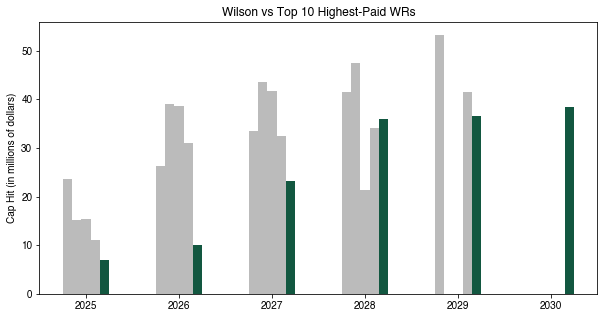
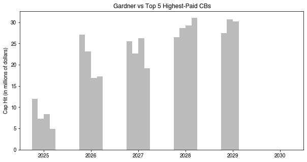
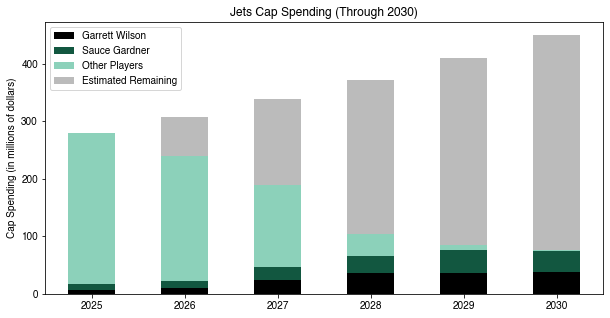

#### A visual analysis of Garrett Wilson and Sauce Gardner's contracts and cap impact

The New York Jets have officially locked in two of their brightest young stars, wide receiver Garrett Wilson and cornerback Sauce Gardner, with massive new contract extensions. As the team looks to solidify a competitive core around a reloaded roster, these deals mark a turning point in the Jets’ long-term cap strategy. The visualizations below explore how Wilson and Gardner’s cap hits stack up against the league’s top earners and what it means for the Jets' salary cap outlook through 2030.

After back-to-back 1,000-yard seasons, Garrett Wilson earned a lucrative extension, positioning him among the NFL’s elite receivers. The chart below compares his projected cap hits to the league's top-paid wideouts like Ja'Marr Chase and Justin Jefferson through 2030.

<table border="1" class="dataframe">
  <thead>
    <tr style="text-align: right;">
      <th></th>
      <th>Year</th>
      <th>Chase</th>
      <th>Jefferson</th>
      <th>Lamb</th>
      <th>Metcalf</th>
      <th>Wilson</th>
    </tr>
  </thead>
  <tbody>
    <tr>
      <th>0</th>
      <td>2025</td>
      <td>23.570</td>
      <td>15.1676</td>
      <td>15.332353</td>
      <td>11.0</td>
      <td>7.032092</td>
    </tr>
    <tr>
      <th>1</th>
      <td>2026</td>
      <td>26.230</td>
      <td>38.9876</td>
      <td>38.600000</td>
      <td>31.0</td>
      <td>10.074000</td>
    </tr>
    <tr>
      <th>2</th>
      <td>2027</td>
      <td>33.400</td>
      <td>43.4876</td>
      <td>41.600000</td>
      <td>32.5</td>
      <td>23.250000</td>
    </tr>
    <tr>
      <th>3</th>
      <td>2028</td>
      <td>41.400</td>
      <td>47.4876</td>
      <td>21.391000</td>
      <td>34.0</td>
      <td>35.925000</td>
    </tr>
    <tr>
      <th>4</th>
      <td>2029</td>
      <td>53.216</td>
      <td>0.0000</td>
      <td>0.000000</td>
      <td>41.5</td>
      <td>36.574000</td>
    </tr>
  </tbody>
</table>

    Text(0, 0.5, 'Cap Hit (in millions of dollars)')

    

    

Sauce Gardner, already a two-time All-Pro by age 24, secured a deal that rivals the biggest names at cornerback. The chart below compares his cap hits to other top CBs, including Patrick Surtain II and Jalen Ramsey.

<table border="1" class="dataframe">
  <thead>
    <tr style="text-align: right;">
      <th></th>
      <th>Year</th>
      <th>Gardner</th>
      <th>Stingley</th>
      <th>Horn</th>
      <th>Surtain Jr.</th>
      <th>Ramsey</th>
    </tr>
  </thead>
  <tbody>
    <tr>
      <th>0</th>
      <td>2025</td>
      <td>9.376964</td>
      <td>12.027366</td>
      <td>7.3504</td>
      <td>8.370</td>
      <td>4.904</td>
    </tr>
    <tr>
      <th>1</th>
      <td>2026</td>
      <td>12.250000</td>
      <td>27.095000</td>
      <td>23.0804</td>
      <td>16.832</td>
      <td>17.229</td>
    </tr>
    <tr>
      <th>2</th>
      <td>2027</td>
      <td>23.703000</td>
      <td>25.500000</td>
      <td>22.6804</td>
      <td>26.200</td>
      <td>19.149</td>
    </tr>
    <tr>
      <th>3</th>
      <td>2028</td>
      <td>28.950000</td>
      <td>26.500000</td>
      <td>28.6804</td>
      <td>29.200</td>
      <td>31.049</td>
    </tr>
    <tr>
      <th>4</th>
      <td>2029</td>
      <td>38.850000</td>
      <td>27.500000</td>
      <td>30.6804</td>
      <td>30.200</td>
      <td>0.000</td>
    </tr>
  </tbody>
</table>

    Text(0, 0.5, 'Cap Hit (in millions of dollars)')

    

    

With both young stars locked in, the Jets’ cap structure reflects major investments in homegrown talent. This stacked bar chart shows how Wilson and Gardner’s contracts impact overall team spending over the next six seasons.

<table border="1" class="dataframe">
  <thead>
    <tr style="text-align: right;">
      <th></th>
      <th>Year</th>
      <th>Wilson</th>
      <th>Gardner</th>
      <th>Jets</th>
      <th>Total</th>
    </tr>
  </thead>
  <tbody>
    <tr>
      <th>0</th>
      <td>2025</td>
      <td>7.032092</td>
      <td>9.376964</td>
      <td>278.596841</td>
      <td>279.20</td>
    </tr>
    <tr>
      <th>1</th>
      <td>2026</td>
      <td>10.074000</td>
      <td>12.250000</td>
      <td>238.871933</td>
      <td>307.12</td>
    </tr>
    <tr>
      <th>2</th>
      <td>2027</td>
      <td>23.250000</td>
      <td>23.703000</td>
      <td>189.612808</td>
      <td>337.83</td>
    </tr>
    <tr>
      <th>3</th>
      <td>2028</td>
      <td>35.925000</td>
      <td>28.950000</td>
      <td>103.385933</td>
      <td>371.62</td>
    </tr>
    <tr>
      <th>4</th>
      <td>2029</td>
      <td>36.574000</td>
      <td>38.850000</td>
      <td>85.424000</td>
      <td>408.78</td>
    </tr>
  </tbody>
</table>

<table border="1" class="dataframe">
  <thead>
    <tr style="text-align: right;">
      <th></th>
      <th>Year</th>
      <th>Wilson</th>
      <th>Gardner</th>
      <th>Jets</th>
      <th>Total</th>
      <th>Other Players</th>
      <th>Remaining</th>
    </tr>
  </thead>
  <tbody>
    <tr>
      <th>0</th>
      <td>2025</td>
      <td>7.032092</td>
      <td>9.376964</td>
      <td>278.596841</td>
      <td>279.20</td>
      <td>262.187785</td>
      <td>0.603159</td>
    </tr>
    <tr>
      <th>1</th>
      <td>2026</td>
      <td>10.074000</td>
      <td>12.250000</td>
      <td>238.871933</td>
      <td>307.12</td>
      <td>216.547933</td>
      <td>68.248067</td>
    </tr>
    <tr>
      <th>2</th>
      <td>2027</td>
      <td>23.250000</td>
      <td>23.703000</td>
      <td>189.612808</td>
      <td>337.83</td>
      <td>142.659808</td>
      <td>148.217192</td>
    </tr>
    <tr>
      <th>3</th>
      <td>2028</td>
      <td>35.925000</td>
      <td>28.950000</td>
      <td>103.385933</td>
      <td>371.62</td>
      <td>38.510933</td>
      <td>268.234067</td>
    </tr>
    <tr>
      <th>4</th>
      <td>2029</td>
      <td>36.574000</td>
      <td>38.850000</td>
      <td>85.424000</td>
      <td>408.78</td>
      <td>10.000000</td>
      <td>323.356000</td>
    </tr>
  </tbody>
</table>

    <matplotlib.legend.Legend at 0x7fb2e551fac0>

    

    

With Wilson and Gardner now among the highest-paid players at their respective positions, the Jets are signaling a clear commitment to building around elite, homegrown talent. While these deals carry significant financial weight, they reflect the team's confidence in its young foundation and a willingness to compete at the highest level. The real challenge will be balancing star contracts with roster depth — but for now, New York has secured two cornerstones for the foreseeable future.

(All contract numbers sourced from Spotrac.com)
