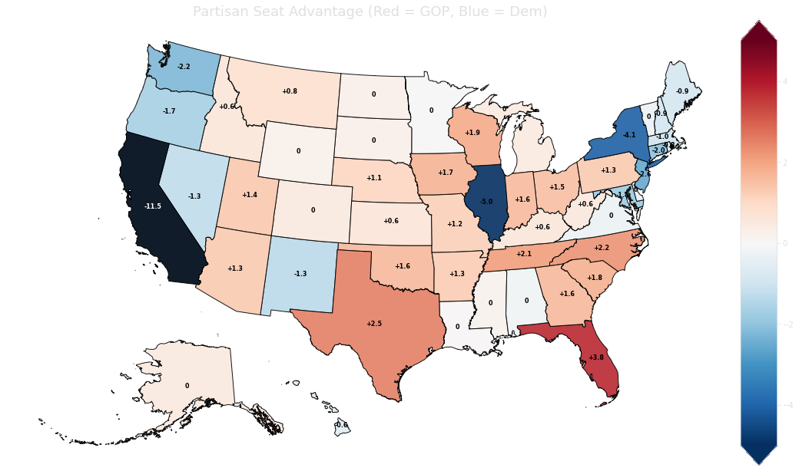
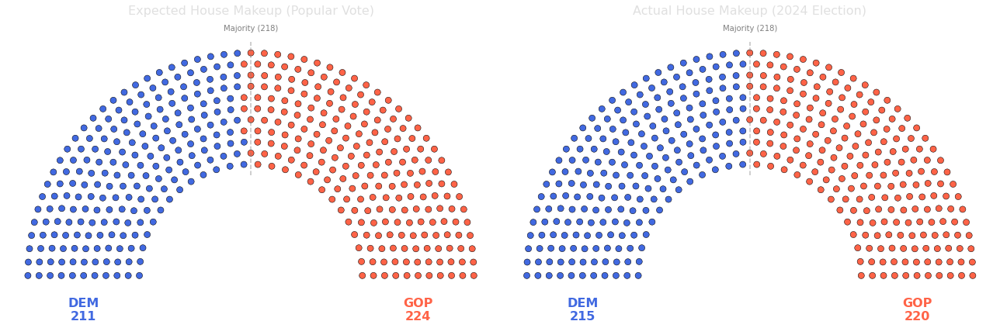

```python
import matplotlib.pyplot as plt
plt.rcParams.update({
    'figure.facecolor': 'none',
    'axes.facecolor': 'none',
    'savefig.facecolor': 'none',
    'text.color': '#e0e0e0',
    'axes.labelcolor': '#e0e0e0',
    'xtick.color': '#e0e0e0',
    'ytick.color': '#e0e0e0',
    'axes.edgecolor': '#e0e0e0'
})

```

# Title: Gerrymandering

#### **Visualizing how state partisan gerrymandering has affected the US House of Representatives**


```python
import pandas as pd
import matplotlib.pyplot as plt
import numpy as np
from IPython.display import Image
import geopandas as gpd
import geodatasets
from shapely.geometry import Polygon
```


```python
df = pd.read_csv("2024_Elections.csv")
df
```


<div>
<style scoped>
    .dataframe tbody tr th:only-of-type {
        vertical-align: middle;
    }

    .dataframe tbody tr th {
        vertical-align: top;
    }

    .dataframe thead th {
        text-align: right;
    }
</style>
<table border="1" class="dataframe">
  <thead>
    <tr style="text-align: right;">
      <th></th>
      <th>State</th>
      <th>Abbreviation</th>
      <th>Population</th>
      <th>Representatives</th>
      <th>D-Reps</th>
      <th>R-Reps</th>
      <th>D-Votes</th>
      <th>R-Votes</th>
    </tr>
  </thead>
  <tbody>
    <tr>
      <th>0</th>
      <td>Alabama</td>
      <td>AL</td>
      <td>5,024,279</td>
      <td>7</td>
      <td>2</td>
      <td>5</td>
      <td>517,881</td>
      <td>1,508,610</td>
    </tr>
    <tr>
      <th>1</th>
      <td>Alaska</td>
      <td>AK</td>
      <td>733,391</td>
      <td>1</td>
      <td>0</td>
      <td>1</td>
      <td>156,985</td>
      <td>164,861</td>
    </tr>
    <tr>
      <th>2</th>
      <td>Arizona</td>
      <td>AZ</td>
      <td>7,151,502</td>
      <td>9</td>
      <td>3</td>
      <td>6</td>
      <td>1,551,107</td>
      <td>1,680,841</td>
    </tr>
    <tr>
      <th>3</th>
      <td>Arkansas</td>
      <td>AR</td>
      <td>3,011,524</td>
      <td>4</td>
      <td>0</td>
      <td>4</td>
      <td>358,553</td>
      <td>764,091</td>
    </tr>
    <tr>
      <th>4</th>
      <td>California</td>
      <td>CA</td>
      <td>39,538,223</td>
      <td>52</td>
      <td>43</td>
      <td>9</td>
      <td>9,138,709</td>
      <td>5,928,084</td>
    </tr>
    <tr>
      <th>5</th>
      <td>Colorado</td>
      <td>CO</td>
      <td>5,773,714</td>
      <td>8</td>
      <td>4</td>
      <td>4</td>
      <td>1,667,163</td>
      <td>1,306,086</td>
    </tr>
    <tr>
      <th>6</th>
      <td>Connecticut</td>
      <td>CT</td>
      <td>3,605,944</td>
      <td>5</td>
      <td>5</td>
      <td>0</td>
      <td>1,000,415</td>
      <td>687,319</td>
    </tr>
    <tr>
      <th>7</th>
      <td>Delaware</td>
      <td>DE</td>
      <td>989,948</td>
      <td>1</td>
      <td>1</td>
      <td>0</td>
      <td>287,830</td>
      <td>209,606</td>
    </tr>
    <tr>
      <th>8</th>
      <td>Florida</td>
      <td>FL</td>
      <td>21,538,187</td>
      <td>28</td>
      <td>8</td>
      <td>20</td>
      <td>4,339,733</td>
      <td>5,975,435</td>
    </tr>
    <tr>
      <th>9</th>
      <td>Georgia</td>
      <td>GA</td>
      <td>10,711,908</td>
      <td>14</td>
      <td>5</td>
      <td>9</td>
      <td>2,434,984</td>
      <td>2,702,118</td>
    </tr>
    <tr>
      <th>10</th>
      <td>Hawaii</td>
      <td>HI</td>
      <td>1,455,271</td>
      <td>2</td>
      <td>2</td>
      <td>0</td>
      <td>330,488</td>
      <td>139,844</td>
    </tr>
    <tr>
      <th>11</th>
      <td>Idaho</td>
      <td>ID</td>
      <td>1,839,106</td>
      <td>2</td>
      <td>0</td>
      <td>2</td>
      <td>244,885</td>
      <td>581,168</td>
    </tr>
    <tr>
      <th>12</th>
      <td>Illinois</td>
      <td>IL</td>
      <td>12,812,508</td>
      <td>17</td>
      <td>14</td>
      <td>3</td>
      <td>2,829,169</td>
      <td>2,517,389</td>
    </tr>
    <tr>
      <th>13</th>
      <td>Indiana</td>
      <td>IN</td>
      <td>6,785,528</td>
      <td>9</td>
      <td>2</td>
      <td>7</td>
      <td>1,103,484</td>
      <td>1,668,618</td>
    </tr>
    <tr>
      <th>14</th>
      <td>Iowa</td>
      <td>IA</td>
      <td>3,190,369</td>
      <td>4</td>
      <td>0</td>
      <td>4</td>
      <td>696,033</td>
      <td>904,563</td>
    </tr>
    <tr>
      <th>15</th>
      <td>Kansas</td>
      <td>KS</td>
      <td>2,937,880</td>
      <td>4</td>
      <td>1</td>
      <td>3</td>
      <td>526,153</td>
      <td>749,375</td>
    </tr>
    <tr>
      <th>16</th>
      <td>Kentucky</td>
      <td>KY</td>
      <td>4,505,836</td>
      <td>6</td>
      <td>1</td>
      <td>5</td>
      <td>511,998</td>
      <td>1,392,354</td>
    </tr>
    <tr>
      <th>17</th>
      <td>Louisiana</td>
      <td>LA</td>
      <td>4,657,757</td>
      <td>6</td>
      <td>2</td>
      <td>4</td>
      <td>650,836</td>
      <td>1,248,101</td>
    </tr>
    <tr>
      <th>18</th>
      <td>Maine</td>
      <td>ME</td>
      <td>1,362,359</td>
      <td>2</td>
      <td>2</td>
      <td>0</td>
      <td>446,949</td>
      <td>349,294</td>
    </tr>
    <tr>
      <th>19</th>
      <td>Maryland</td>
      <td>MD</td>
      <td>6,177,224</td>
      <td>8</td>
      <td>7</td>
      <td>1</td>
      <td>1,863,416</td>
      <td>1,017,654</td>
    </tr>
    <tr>
      <th>20</th>
      <td>Massachusetts</td>
      <td>MA</td>
      <td>7,029,917</td>
      <td>9</td>
      <td>9</td>
      <td>0</td>
      <td>2,386,170</td>
      <td>304,460</td>
    </tr>
    <tr>
      <th>21</th>
      <td>Michigan</td>
      <td>MI</td>
      <td>10,077,331</td>
      <td>13</td>
      <td>6</td>
      <td>7</td>
      <td>2,634,228</td>
      <td>2,676,970</td>
    </tr>
    <tr>
      <th>22</th>
      <td>Minnesota</td>
      <td>MN</td>
      <td>5,706,494</td>
      <td>8</td>
      <td>4</td>
      <td>4</td>
      <td>1,579,742</td>
      <td>1,550,499</td>
    </tr>
    <tr>
      <th>23</th>
      <td>Mississippi</td>
      <td>MS</td>
      <td>2,961,279</td>
      <td>4</td>
      <td>1</td>
      <td>3</td>
      <td>350,353</td>
      <td>812,799</td>
    </tr>
    <tr>
      <th>24</th>
      <td>Missouri</td>
      <td>MO</td>
      <td>6,154,913</td>
      <td>8</td>
      <td>2</td>
      <td>6</td>
      <td>1,116,732</td>
      <td>1,698,595</td>
    </tr>
    <tr>
      <th>25</th>
      <td>Montana</td>
      <td>MT</td>
      <td>1,084,225</td>
      <td>2</td>
      <td>0</td>
      <td>2</td>
      <td>237,496</td>
      <td>350,361</td>
    </tr>
    <tr>
      <th>26</th>
      <td>Nebraska</td>
      <td>NE</td>
      <td>1,961,504</td>
      <td>3</td>
      <td>0</td>
      <td>3</td>
      <td>338,154</td>
      <td>591,238</td>
    </tr>
    <tr>
      <th>27</th>
      <td>Nevada</td>
      <td>NV</td>
      <td>3,104,614</td>
      <td>4</td>
      <td>3</td>
      <td>1</td>
      <td>534,115</td>
      <td>692,714</td>
    </tr>
    <tr>
      <th>28</th>
      <td>New Hampshire</td>
      <td>NH</td>
      <td>1,377,529</td>
      <td>2</td>
      <td>2</td>
      <td>0</td>
      <td>430,218</td>
      <td>373,746</td>
    </tr>
    <tr>
      <th>29</th>
      <td>New Jersey</td>
      <td>NJ</td>
      <td>9,288,994</td>
      <td>12</td>
      <td>9</td>
      <td>3</td>
      <td>2,115,843</td>
      <td>1,828,853</td>
    </tr>
    <tr>
      <th>30</th>
      <td>New Mexico</td>
      <td>NM</td>
      <td>2,117,522</td>
      <td>3</td>
      <td>3</td>
      <td>0</td>
      <td>493,722</td>
      <td>402,776</td>
    </tr>
    <tr>
      <th>31</th>
      <td>New York</td>
      <td>NY</td>
      <td>20,201,249</td>
      <td>26</td>
      <td>19</td>
      <td>7</td>
      <td>4,527,087</td>
      <td>3,364,296</td>
    </tr>
    <tr>
      <th>32</th>
      <td>North Carolina</td>
      <td>NC</td>
      <td>10,439,388</td>
      <td>14</td>
      <td>4</td>
      <td>10</td>
      <td>2,328,248</td>
      <td>2,889,657</td>
    </tr>
    <tr>
      <th>33</th>
      <td>North Dakota</td>
      <td>ND</td>
      <td>779,094</td>
      <td>1</td>
      <td>0</td>
      <td>1</td>
      <td>109,231</td>
      <td>249,101</td>
    </tr>
    <tr>
      <th>34</th>
      <td>Ohio</td>
      <td>OH</td>
      <td>11,799,448</td>
      <td>15</td>
      <td>5</td>
      <td>10</td>
      <td>2,382,078</td>
      <td>3,104,290</td>
    </tr>
    <tr>
      <th>35</th>
      <td>Oklahoma</td>
      <td>OK</td>
      <td>3,959,353</td>
      <td>5</td>
      <td>0</td>
      <td>5</td>
      <td>397,829</td>
      <td>834,553</td>
    </tr>
    <tr>
      <th>36</th>
      <td>Oregon</td>
      <td>OR</td>
      <td>4,237,256</td>
      <td>6</td>
      <td>5</td>
      <td>1</td>
      <td>1,151,394</td>
      <td>912,337</td>
    </tr>
    <tr>
      <th>37</th>
      <td>Pennsylvania</td>
      <td>PA</td>
      <td>13,002,700</td>
      <td>17</td>
      <td>7</td>
      <td>10</td>
      <td>3,338,371</td>
      <td>3,481,113</td>
    </tr>
    <tr>
      <th>38</th>
      <td>Rhode Island</td>
      <td>RI</td>
      <td>1,097,379</td>
      <td>2</td>
      <td>2</td>
      <td>0</td>
      <td>292,791</td>
      <td>180,123</td>
    </tr>
    <tr>
      <th>39</th>
      <td>South Carolina</td>
      <td>SC</td>
      <td>5,118,425</td>
      <td>7</td>
      <td>1</td>
      <td>6</td>
      <td>960,885</td>
      <td>1,470,674</td>
    </tr>
    <tr>
      <th>40</th>
      <td>South Dakota</td>
      <td>SD</td>
      <td>886,667</td>
      <td>1</td>
      <td>0</td>
      <td>1</td>
      <td>117,818</td>
      <td>303,630</td>
    </tr>
    <tr>
      <th>41</th>
      <td>Tennessee</td>
      <td>TN</td>
      <td>6,910,840</td>
      <td>9</td>
      <td>1</td>
      <td>8</td>
      <td>977,870</td>
      <td>1,884,691</td>
    </tr>
    <tr>
      <th>42</th>
      <td>Texas</td>
      <td>TX</td>
      <td>29,145,505</td>
      <td>38</td>
      <td>13</td>
      <td>25</td>
      <td>4,311,123</td>
      <td>6,235,017</td>
    </tr>
    <tr>
      <th>43</th>
      <td>Utah</td>
      <td>UT</td>
      <td>3,271,616</td>
      <td>4</td>
      <td>0</td>
      <td>4</td>
      <td>471,051</td>
      <td>909,332</td>
    </tr>
    <tr>
      <th>44</th>
      <td>Vermont</td>
      <td>VT</td>
      <td>643,077</td>
      <td>1</td>
      <td>1</td>
      <td>0</td>
      <td>218,398</td>
      <td>104,451</td>
    </tr>
    <tr>
      <th>45</th>
      <td>Virginia</td>
      <td>VA</td>
      <td>8,631,393</td>
      <td>11</td>
      <td>6</td>
      <td>5</td>
      <td>2,274,922</td>
      <td>2,108,450</td>
    </tr>
    <tr>
      <th>46</th>
      <td>Washington</td>
      <td>WA</td>
      <td>7,705,281</td>
      <td>10</td>
      <td>8</td>
      <td>2</td>
      <td>2,155,907</td>
      <td>1,592,599</td>
    </tr>
    <tr>
      <th>47</th>
      <td>West Virginia</td>
      <td>WV</td>
      <td>1,793,716</td>
      <td>2</td>
      <td>0</td>
      <td>2</td>
      <td>200,813</td>
      <td>496,681</td>
    </tr>
    <tr>
      <th>48</th>
      <td>Wisconsin</td>
      <td>WI</td>
      <td>5,893,718</td>
      <td>8</td>
      <td>2</td>
      <td>6</td>
      <td>1,603,350</td>
      <td>1,701,860</td>
    </tr>
    <tr>
      <th>49</th>
      <td>Wyoming</td>
      <td>WY</td>
      <td>576,851</td>
      <td>1</td>
      <td>0</td>
      <td>1</td>
      <td>60,778</td>
      <td>184,680</td>
    </tr>
  </tbody>
</table>
</div>


```python
df['D-Votes'] = df['D-Votes'].str.replace(',', '')
df['R-Votes'] = df['R-Votes'].str.replace(',', '')
df['D-Votes'] = pd.to_numeric(df['D-Votes'])
df['R-Votes'] = pd.to_numeric(df['R-Votes'])

df['D-Percentage'] = df['D-Votes'] / (df['D-Votes'] + df['R-Votes'])
df['R-Percentage'] = df['R-Votes'] / (df['D-Votes'] + df['R-Votes'])
```


```python
df['D-Expected'] = df['Representatives'] * df['D-Percentage']
df['R-Expected'] = df['Representatives'] * df['R-Percentage']

df['D-Swing'] = df['D-Reps'] - df['D-Expected']
df['R-Swing'] = df['R-Reps'] - df['R-Expected']
```


```python
sum(df['D-Swing'])
df.sort_values("D-Swing")
```


<div>
<style scoped>
    .dataframe tbody tr th:only-of-type {
        vertical-align: middle;
    }

    .dataframe tbody tr th {
        vertical-align: top;
    }

    .dataframe thead th {
        text-align: right;
    }
</style>
<table border="1" class="dataframe">
  <thead>
    <tr style="text-align: right;">
      <th></th>
      <th>State</th>
      <th>Abbreviation</th>
      <th>Population</th>
      <th>Representatives</th>
      <th>D-Reps</th>
      <th>R-Reps</th>
      <th>D-Votes</th>
      <th>R-Votes</th>
      <th>D-Percentage</th>
      <th>R-Percentage</th>
      <th>D-Expected</th>
      <th>R-Expected</th>
      <th>D-Swing</th>
      <th>R-Swing</th>
    </tr>
  </thead>
  <tbody>
    <tr>
      <th>8</th>
      <td>Florida</td>
      <td>FL</td>
      <td>21,538,187</td>
      <td>28</td>
      <td>8</td>
      <td>20</td>
      <td>4339733</td>
      <td>5975435</td>
      <td>0.420714</td>
      <td>0.579286</td>
      <td>11.779985</td>
      <td>16.220015</td>
      <td>-3.779985</td>
      <td>3.779985</td>
    </tr>
    <tr>
      <th>42</th>
      <td>Texas</td>
      <td>TX</td>
      <td>29,145,505</td>
      <td>38</td>
      <td>13</td>
      <td>25</td>
      <td>4311123</td>
      <td>6235017</td>
      <td>0.408787</td>
      <td>0.591213</td>
      <td>15.533899</td>
      <td>22.466101</td>
      <td>-2.533899</td>
      <td>2.533899</td>
    </tr>
    <tr>
      <th>32</th>
      <td>North Carolina</td>
      <td>NC</td>
      <td>10,439,388</td>
      <td>14</td>
      <td>4</td>
      <td>10</td>
      <td>2328248</td>
      <td>2889657</td>
      <td>0.446204</td>
      <td>0.553796</td>
      <td>6.246850</td>
      <td>7.753150</td>
      <td>-2.246850</td>
      <td>2.246850</td>
    </tr>
    <tr>
      <th>41</th>
      <td>Tennessee</td>
      <td>TN</td>
      <td>6,910,840</td>
      <td>9</td>
      <td>1</td>
      <td>8</td>
      <td>977870</td>
      <td>1884691</td>
      <td>0.341607</td>
      <td>0.658393</td>
      <td>3.074460</td>
      <td>5.925540</td>
      <td>-2.074460</td>
      <td>2.074460</td>
    </tr>
    <tr>
      <th>48</th>
      <td>Wisconsin</td>
      <td>WI</td>
      <td>5,893,718</td>
      <td>8</td>
      <td>2</td>
      <td>6</td>
      <td>1603350</td>
      <td>1701860</td>
      <td>0.485098</td>
      <td>0.514902</td>
      <td>3.880782</td>
      <td>4.119218</td>
      <td>-1.880782</td>
      <td>1.880782</td>
    </tr>
    <tr>
      <th>39</th>
      <td>South Carolina</td>
      <td>SC</td>
      <td>5,118,425</td>
      <td>7</td>
      <td>1</td>
      <td>6</td>
      <td>960885</td>
      <td>1470674</td>
      <td>0.395172</td>
      <td>0.604828</td>
      <td>2.766207</td>
      <td>4.233793</td>
      <td>-1.766207</td>
      <td>1.766207</td>
    </tr>
    <tr>
      <th>14</th>
      <td>Iowa</td>
      <td>IA</td>
      <td>3,190,369</td>
      <td>4</td>
      <td>0</td>
      <td>4</td>
      <td>696033</td>
      <td>904563</td>
      <td>0.434859</td>
      <td>0.565141</td>
      <td>1.739435</td>
      <td>2.260565</td>
      <td>-1.739435</td>
      <td>1.739435</td>
    </tr>
    <tr>
      <th>9</th>
      <td>Georgia</td>
      <td>GA</td>
      <td>10,711,908</td>
      <td>14</td>
      <td>5</td>
      <td>9</td>
      <td>2434984</td>
      <td>2702118</td>
      <td>0.474000</td>
      <td>0.526000</td>
      <td>6.635994</td>
      <td>7.364006</td>
      <td>-1.635994</td>
      <td>1.635994</td>
    </tr>
    <tr>
      <th>35</th>
      <td>Oklahoma</td>
      <td>OK</td>
      <td>3,959,353</td>
      <td>5</td>
      <td>0</td>
      <td>5</td>
      <td>397829</td>
      <td>834553</td>
      <td>0.322813</td>
      <td>0.677187</td>
      <td>1.614065</td>
      <td>3.385935</td>
      <td>-1.614065</td>
      <td>1.614065</td>
    </tr>
    <tr>
      <th>13</th>
      <td>Indiana</td>
      <td>IN</td>
      <td>6,785,528</td>
      <td>9</td>
      <td>2</td>
      <td>7</td>
      <td>1103484</td>
      <td>1668618</td>
      <td>0.398068</td>
      <td>0.601932</td>
      <td>3.582608</td>
      <td>5.417392</td>
      <td>-1.582608</td>
      <td>1.582608</td>
    </tr>
    <tr>
      <th>34</th>
      <td>Ohio</td>
      <td>OH</td>
      <td>11,799,448</td>
      <td>15</td>
      <td>5</td>
      <td>10</td>
      <td>2382078</td>
      <td>3104290</td>
      <td>0.434181</td>
      <td>0.565819</td>
      <td>6.512718</td>
      <td>8.487282</td>
      <td>-1.512718</td>
      <td>1.512718</td>
    </tr>
    <tr>
      <th>43</th>
      <td>Utah</td>
      <td>UT</td>
      <td>3,271,616</td>
      <td>4</td>
      <td>0</td>
      <td>4</td>
      <td>471051</td>
      <td>909332</td>
      <td>0.341247</td>
      <td>0.658753</td>
      <td>1.364986</td>
      <td>2.635014</td>
      <td>-1.364986</td>
      <td>1.364986</td>
    </tr>
    <tr>
      <th>37</th>
      <td>Pennsylvania</td>
      <td>PA</td>
      <td>13,002,700</td>
      <td>17</td>
      <td>7</td>
      <td>10</td>
      <td>3338371</td>
      <td>3481113</td>
      <td>0.489534</td>
      <td>0.510466</td>
      <td>8.322082</td>
      <td>8.677918</td>
      <td>-1.322082</td>
      <td>1.322082</td>
    </tr>
    <tr>
      <th>2</th>
      <td>Arizona</td>
      <td>AZ</td>
      <td>7,151,502</td>
      <td>9</td>
      <td>3</td>
      <td>6</td>
      <td>1551107</td>
      <td>1680841</td>
      <td>0.479929</td>
      <td>0.520071</td>
      <td>4.319365</td>
      <td>4.680635</td>
      <td>-1.319365</td>
      <td>1.319365</td>
    </tr>
    <tr>
      <th>3</th>
      <td>Arkansas</td>
      <td>AR</td>
      <td>3,011,524</td>
      <td>4</td>
      <td>0</td>
      <td>4</td>
      <td>358553</td>
      <td>764091</td>
      <td>0.319383</td>
      <td>0.680617</td>
      <td>1.277531</td>
      <td>2.722469</td>
      <td>-1.277531</td>
      <td>1.277531</td>
    </tr>
    <tr>
      <th>24</th>
      <td>Missouri</td>
      <td>MO</td>
      <td>6,154,913</td>
      <td>8</td>
      <td>2</td>
      <td>6</td>
      <td>1116732</td>
      <td>1698595</td>
      <td>0.396662</td>
      <td>0.603338</td>
      <td>3.173292</td>
      <td>4.826708</td>
      <td>-1.173292</td>
      <td>1.173292</td>
    </tr>
    <tr>
      <th>26</th>
      <td>Nebraska</td>
      <td>NE</td>
      <td>1,961,504</td>
      <td>3</td>
      <td>0</td>
      <td>3</td>
      <td>338154</td>
      <td>591238</td>
      <td>0.363844</td>
      <td>0.636156</td>
      <td>1.091533</td>
      <td>1.908467</td>
      <td>-1.091533</td>
      <td>1.091533</td>
    </tr>
    <tr>
      <th>25</th>
      <td>Montana</td>
      <td>MT</td>
      <td>1,084,225</td>
      <td>2</td>
      <td>0</td>
      <td>2</td>
      <td>237496</td>
      <td>350361</td>
      <td>0.404003</td>
      <td>0.595997</td>
      <td>0.808006</td>
      <td>1.191994</td>
      <td>-0.808006</td>
      <td>0.808006</td>
    </tr>
    <tr>
      <th>15</th>
      <td>Kansas</td>
      <td>KS</td>
      <td>2,937,880</td>
      <td>4</td>
      <td>1</td>
      <td>3</td>
      <td>526153</td>
      <td>749375</td>
      <td>0.412498</td>
      <td>0.587502</td>
      <td>1.649993</td>
      <td>2.350007</td>
      <td>-0.649993</td>
      <td>0.649993</td>
    </tr>
    <tr>
      <th>16</th>
      <td>Kentucky</td>
      <td>KY</td>
      <td>4,505,836</td>
      <td>6</td>
      <td>1</td>
      <td>5</td>
      <td>511998</td>
      <td>1392354</td>
      <td>0.268857</td>
      <td>0.731143</td>
      <td>1.613141</td>
      <td>4.386859</td>
      <td>-0.613141</td>
      <td>0.613141</td>
    </tr>
    <tr>
      <th>11</th>
      <td>Idaho</td>
      <td>ID</td>
      <td>1,839,106</td>
      <td>2</td>
      <td>0</td>
      <td>2</td>
      <td>244885</td>
      <td>581168</td>
      <td>0.296452</td>
      <td>0.703548</td>
      <td>0.592904</td>
      <td>1.407096</td>
      <td>-0.592904</td>
      <td>0.592904</td>
    </tr>
    <tr>
      <th>47</th>
      <td>West Virginia</td>
      <td>WV</td>
      <td>1,793,716</td>
      <td>2</td>
      <td>0</td>
      <td>2</td>
      <td>200813</td>
      <td>496681</td>
      <td>0.287906</td>
      <td>0.712094</td>
      <td>0.575813</td>
      <td>1.424187</td>
      <td>-0.575813</td>
      <td>0.575813</td>
    </tr>
    <tr>
      <th>1</th>
      <td>Alaska</td>
      <td>AK</td>
      <td>733,391</td>
      <td>1</td>
      <td>0</td>
      <td>1</td>
      <td>156985</td>
      <td>164861</td>
      <td>0.487764</td>
      <td>0.512236</td>
      <td>0.487764</td>
      <td>0.512236</td>
      <td>-0.487764</td>
      <td>0.487764</td>
    </tr>
    <tr>
      <th>5</th>
      <td>Colorado</td>
      <td>CO</td>
      <td>5,773,714</td>
      <td>8</td>
      <td>4</td>
      <td>4</td>
      <td>1667163</td>
      <td>1306086</td>
      <td>0.560721</td>
      <td>0.439279</td>
      <td>4.485768</td>
      <td>3.514232</td>
      <td>-0.485768</td>
      <td>0.485768</td>
    </tr>
    <tr>
      <th>21</th>
      <td>Michigan</td>
      <td>MI</td>
      <td>10,077,331</td>
      <td>13</td>
      <td>6</td>
      <td>7</td>
      <td>2634228</td>
      <td>2676970</td>
      <td>0.495976</td>
      <td>0.504024</td>
      <td>6.447691</td>
      <td>6.552309</td>
      <td>-0.447691</td>
      <td>0.447691</td>
    </tr>
    <tr>
      <th>33</th>
      <td>North Dakota</td>
      <td>ND</td>
      <td>779,094</td>
      <td>1</td>
      <td>0</td>
      <td>1</td>
      <td>109231</td>
      <td>249101</td>
      <td>0.304832</td>
      <td>0.695168</td>
      <td>0.304832</td>
      <td>0.695168</td>
      <td>-0.304832</td>
      <td>0.304832</td>
    </tr>
    <tr>
      <th>40</th>
      <td>South Dakota</td>
      <td>SD</td>
      <td>886,667</td>
      <td>1</td>
      <td>0</td>
      <td>1</td>
      <td>117818</td>
      <td>303630</td>
      <td>0.279555</td>
      <td>0.720445</td>
      <td>0.279555</td>
      <td>0.720445</td>
      <td>-0.279555</td>
      <td>0.279555</td>
    </tr>
    <tr>
      <th>49</th>
      <td>Wyoming</td>
      <td>WY</td>
      <td>576,851</td>
      <td>1</td>
      <td>0</td>
      <td>1</td>
      <td>60778</td>
      <td>184680</td>
      <td>0.247611</td>
      <td>0.752389</td>
      <td>0.247611</td>
      <td>0.752389</td>
      <td>-0.247611</td>
      <td>0.247611</td>
    </tr>
    <tr>
      <th>23</th>
      <td>Mississippi</td>
      <td>MS</td>
      <td>2,961,279</td>
      <td>4</td>
      <td>1</td>
      <td>3</td>
      <td>350353</td>
      <td>812799</td>
      <td>0.301210</td>
      <td>0.698790</td>
      <td>1.204840</td>
      <td>2.795160</td>
      <td>-0.204840</td>
      <td>0.204840</td>
    </tr>
    <tr>
      <th>17</th>
      <td>Louisiana</td>
      <td>LA</td>
      <td>4,657,757</td>
      <td>6</td>
      <td>2</td>
      <td>4</td>
      <td>650836</td>
      <td>1248101</td>
      <td>0.342737</td>
      <td>0.657263</td>
      <td>2.056422</td>
      <td>3.943578</td>
      <td>-0.056422</td>
      <td>0.056422</td>
    </tr>
    <tr>
      <th>22</th>
      <td>Minnesota</td>
      <td>MN</td>
      <td>5,706,494</td>
      <td>8</td>
      <td>4</td>
      <td>4</td>
      <td>1579742</td>
      <td>1550499</td>
      <td>0.504671</td>
      <td>0.495329</td>
      <td>4.037368</td>
      <td>3.962632</td>
      <td>-0.037368</td>
      <td>0.037368</td>
    </tr>
    <tr>
      <th>0</th>
      <td>Alabama</td>
      <td>AL</td>
      <td>5,024,279</td>
      <td>7</td>
      <td>2</td>
      <td>5</td>
      <td>517881</td>
      <td>1508610</td>
      <td>0.255556</td>
      <td>0.744444</td>
      <td>1.788889</td>
      <td>5.211111</td>
      <td>0.211111</td>
      <td>-0.211111</td>
    </tr>
    <tr>
      <th>45</th>
      <td>Virginia</td>
      <td>VA</td>
      <td>8,631,393</td>
      <td>11</td>
      <td>6</td>
      <td>5</td>
      <td>2274922</td>
      <td>2108450</td>
      <td>0.518989</td>
      <td>0.481011</td>
      <td>5.708879</td>
      <td>5.291121</td>
      <td>0.291121</td>
      <td>-0.291121</td>
    </tr>
    <tr>
      <th>44</th>
      <td>Vermont</td>
      <td>VT</td>
      <td>643,077</td>
      <td>1</td>
      <td>1</td>
      <td>0</td>
      <td>218398</td>
      <td>104451</td>
      <td>0.676471</td>
      <td>0.323529</td>
      <td>0.676471</td>
      <td>0.323529</td>
      <td>0.323529</td>
      <td>-0.323529</td>
    </tr>
    <tr>
      <th>7</th>
      <td>Delaware</td>
      <td>DE</td>
      <td>989,948</td>
      <td>1</td>
      <td>1</td>
      <td>0</td>
      <td>287830</td>
      <td>209606</td>
      <td>0.578627</td>
      <td>0.421373</td>
      <td>0.578627</td>
      <td>0.421373</td>
      <td>0.421373</td>
      <td>-0.421373</td>
    </tr>
    <tr>
      <th>10</th>
      <td>Hawaii</td>
      <td>HI</td>
      <td>1,455,271</td>
      <td>2</td>
      <td>2</td>
      <td>0</td>
      <td>330488</td>
      <td>139844</td>
      <td>0.702670</td>
      <td>0.297330</td>
      <td>1.405339</td>
      <td>0.594661</td>
      <td>0.594661</td>
      <td>-0.594661</td>
    </tr>
    <tr>
      <th>38</th>
      <td>Rhode Island</td>
      <td>RI</td>
      <td>1,097,379</td>
      <td>2</td>
      <td>2</td>
      <td>0</td>
      <td>292791</td>
      <td>180123</td>
      <td>0.619121</td>
      <td>0.380879</td>
      <td>1.238242</td>
      <td>0.761758</td>
      <td>0.761758</td>
      <td>-0.761758</td>
    </tr>
    <tr>
      <th>18</th>
      <td>Maine</td>
      <td>ME</td>
      <td>1,362,359</td>
      <td>2</td>
      <td>2</td>
      <td>0</td>
      <td>446949</td>
      <td>349294</td>
      <td>0.561322</td>
      <td>0.438678</td>
      <td>1.122645</td>
      <td>0.877355</td>
      <td>0.877355</td>
      <td>-0.877355</td>
    </tr>
    <tr>
      <th>28</th>
      <td>New Hampshire</td>
      <td>NH</td>
      <td>1,377,529</td>
      <td>2</td>
      <td>2</td>
      <td>0</td>
      <td>430218</td>
      <td>373746</td>
      <td>0.535121</td>
      <td>0.464879</td>
      <td>1.070242</td>
      <td>0.929758</td>
      <td>0.929758</td>
      <td>-0.929758</td>
    </tr>
    <tr>
      <th>20</th>
      <td>Massachusetts</td>
      <td>MA</td>
      <td>7,029,917</td>
      <td>9</td>
      <td>9</td>
      <td>0</td>
      <td>2386170</td>
      <td>304460</td>
      <td>0.886844</td>
      <td>0.113156</td>
      <td>7.981599</td>
      <td>1.018401</td>
      <td>1.018401</td>
      <td>-1.018401</td>
    </tr>
    <tr>
      <th>27</th>
      <td>Nevada</td>
      <td>NV</td>
      <td>3,104,614</td>
      <td>4</td>
      <td>3</td>
      <td>1</td>
      <td>534115</td>
      <td>692714</td>
      <td>0.435362</td>
      <td>0.564638</td>
      <td>1.741449</td>
      <td>2.258551</td>
      <td>1.258551</td>
      <td>-1.258551</td>
    </tr>
    <tr>
      <th>30</th>
      <td>New Mexico</td>
      <td>NM</td>
      <td>2,117,522</td>
      <td>3</td>
      <td>3</td>
      <td>0</td>
      <td>493722</td>
      <td>402776</td>
      <td>0.550723</td>
      <td>0.449277</td>
      <td>1.652169</td>
      <td>1.347831</td>
      <td>1.347831</td>
      <td>-1.347831</td>
    </tr>
    <tr>
      <th>36</th>
      <td>Oregon</td>
      <td>OR</td>
      <td>4,237,256</td>
      <td>6</td>
      <td>5</td>
      <td>1</td>
      <td>1151394</td>
      <td>912337</td>
      <td>0.557919</td>
      <td>0.442081</td>
      <td>3.347512</td>
      <td>2.652488</td>
      <td>1.652488</td>
      <td>-1.652488</td>
    </tr>
    <tr>
      <th>19</th>
      <td>Maryland</td>
      <td>MD</td>
      <td>6,177,224</td>
      <td>8</td>
      <td>7</td>
      <td>1</td>
      <td>1863416</td>
      <td>1017654</td>
      <td>0.646779</td>
      <td>0.353221</td>
      <td>5.174233</td>
      <td>2.825767</td>
      <td>1.825767</td>
      <td>-1.825767</td>
    </tr>
    <tr>
      <th>6</th>
      <td>Connecticut</td>
      <td>CT</td>
      <td>3,605,944</td>
      <td>5</td>
      <td>5</td>
      <td>0</td>
      <td>1000415</td>
      <td>687319</td>
      <td>0.592756</td>
      <td>0.407244</td>
      <td>2.963782</td>
      <td>2.036218</td>
      <td>2.036218</td>
      <td>-2.036218</td>
    </tr>
    <tr>
      <th>46</th>
      <td>Washington</td>
      <td>WA</td>
      <td>7,705,281</td>
      <td>10</td>
      <td>8</td>
      <td>2</td>
      <td>2155907</td>
      <td>1592599</td>
      <td>0.575138</td>
      <td>0.424862</td>
      <td>5.751377</td>
      <td>4.248623</td>
      <td>2.248623</td>
      <td>-2.248623</td>
    </tr>
    <tr>
      <th>29</th>
      <td>New Jersey</td>
      <td>NJ</td>
      <td>9,288,994</td>
      <td>12</td>
      <td>9</td>
      <td>3</td>
      <td>2115843</td>
      <td>1828853</td>
      <td>0.536377</td>
      <td>0.463623</td>
      <td>6.436520</td>
      <td>5.563480</td>
      <td>2.563480</td>
      <td>-2.563480</td>
    </tr>
    <tr>
      <th>31</th>
      <td>New York</td>
      <td>NY</td>
      <td>20,201,249</td>
      <td>26</td>
      <td>19</td>
      <td>7</td>
      <td>4527087</td>
      <td>3364296</td>
      <td>0.573675</td>
      <td>0.426325</td>
      <td>14.915543</td>
      <td>11.084457</td>
      <td>4.084457</td>
      <td>-4.084457</td>
    </tr>
    <tr>
      <th>12</th>
      <td>Illinois</td>
      <td>IL</td>
      <td>12,812,508</td>
      <td>17</td>
      <td>14</td>
      <td>3</td>
      <td>2829169</td>
      <td>2517389</td>
      <td>0.529157</td>
      <td>0.470843</td>
      <td>8.995670</td>
      <td>8.004330</td>
      <td>5.004330</td>
      <td>-5.004330</td>
    </tr>
    <tr>
      <th>4</th>
      <td>California</td>
      <td>CA</td>
      <td>39,538,223</td>
      <td>52</td>
      <td>43</td>
      <td>9</td>
      <td>9138709</td>
      <td>5928084</td>
      <td>0.606546</td>
      <td>0.393454</td>
      <td>31.540413</td>
      <td>20.459587</td>
      <td>11.459587</td>
      <td>-11.459587</td>
    </tr>
  </tbody>
</table>
</div>


```python
df['D-Reps-Percentage'] = df['D-Reps'] / df['Representatives']
df['R-Reps-Percentage'] = df['R-Reps'] / df['Representatives']

df['D-Percentage-Swing'] = df['D-Reps-Percentage'] - df['D-Percentage']
df['R-Percentage-Swing'] = df['R-Reps-Percentage'] - df['R-Percentage']

df.sort_values("D-Percentage-Swing")
```


<div>
<style scoped>
    .dataframe tbody tr th:only-of-type {
        vertical-align: middle;
    }

    .dataframe tbody tr th {
        vertical-align: top;
    }

    .dataframe thead th {
        text-align: right;
    }
</style>
<table border="1" class="dataframe">
  <thead>
    <tr style="text-align: right;">
      <th></th>
      <th>State</th>
      <th>Abbreviation</th>
      <th>Population</th>
      <th>Representatives</th>
      <th>D-Reps</th>
      <th>R-Reps</th>
      <th>D-Votes</th>
      <th>R-Votes</th>
      <th>D-Percentage</th>
      <th>R-Percentage</th>
      <th>D-Expected</th>
      <th>R-Expected</th>
      <th>D-Swing</th>
      <th>R-Swing</th>
      <th>D-Reps-Percentage</th>
      <th>R-Reps-Percentage</th>
      <th>D-Percentage-Swing</th>
      <th>R-Percentage-Swing</th>
    </tr>
  </thead>
  <tbody>
    <tr>
      <th>1</th>
      <td>Alaska</td>
      <td>AK</td>
      <td>733,391</td>
      <td>1</td>
      <td>0</td>
      <td>1</td>
      <td>156985</td>
      <td>164861</td>
      <td>0.487764</td>
      <td>0.512236</td>
      <td>0.487764</td>
      <td>0.512236</td>
      <td>-0.487764</td>
      <td>0.487764</td>
      <td>0.000000</td>
      <td>1.000000</td>
      <td>-0.487764</td>
      <td>0.487764</td>
    </tr>
    <tr>
      <th>14</th>
      <td>Iowa</td>
      <td>IA</td>
      <td>3,190,369</td>
      <td>4</td>
      <td>0</td>
      <td>4</td>
      <td>696033</td>
      <td>904563</td>
      <td>0.434859</td>
      <td>0.565141</td>
      <td>1.739435</td>
      <td>2.260565</td>
      <td>-1.739435</td>
      <td>1.739435</td>
      <td>0.000000</td>
      <td>1.000000</td>
      <td>-0.434859</td>
      <td>0.434859</td>
    </tr>
    <tr>
      <th>25</th>
      <td>Montana</td>
      <td>MT</td>
      <td>1,084,225</td>
      <td>2</td>
      <td>0</td>
      <td>2</td>
      <td>237496</td>
      <td>350361</td>
      <td>0.404003</td>
      <td>0.595997</td>
      <td>0.808006</td>
      <td>1.191994</td>
      <td>-0.808006</td>
      <td>0.808006</td>
      <td>0.000000</td>
      <td>1.000000</td>
      <td>-0.404003</td>
      <td>0.404003</td>
    </tr>
    <tr>
      <th>26</th>
      <td>Nebraska</td>
      <td>NE</td>
      <td>1,961,504</td>
      <td>3</td>
      <td>0</td>
      <td>3</td>
      <td>338154</td>
      <td>591238</td>
      <td>0.363844</td>
      <td>0.636156</td>
      <td>1.091533</td>
      <td>1.908467</td>
      <td>-1.091533</td>
      <td>1.091533</td>
      <td>0.000000</td>
      <td>1.000000</td>
      <td>-0.363844</td>
      <td>0.363844</td>
    </tr>
    <tr>
      <th>43</th>
      <td>Utah</td>
      <td>UT</td>
      <td>3,271,616</td>
      <td>4</td>
      <td>0</td>
      <td>4</td>
      <td>471051</td>
      <td>909332</td>
      <td>0.341247</td>
      <td>0.658753</td>
      <td>1.364986</td>
      <td>2.635014</td>
      <td>-1.364986</td>
      <td>1.364986</td>
      <td>0.000000</td>
      <td>1.000000</td>
      <td>-0.341247</td>
      <td>0.341247</td>
    </tr>
    <tr>
      <th>35</th>
      <td>Oklahoma</td>
      <td>OK</td>
      <td>3,959,353</td>
      <td>5</td>
      <td>0</td>
      <td>5</td>
      <td>397829</td>
      <td>834553</td>
      <td>0.322813</td>
      <td>0.677187</td>
      <td>1.614065</td>
      <td>3.385935</td>
      <td>-1.614065</td>
      <td>1.614065</td>
      <td>0.000000</td>
      <td>1.000000</td>
      <td>-0.322813</td>
      <td>0.322813</td>
    </tr>
    <tr>
      <th>3</th>
      <td>Arkansas</td>
      <td>AR</td>
      <td>3,011,524</td>
      <td>4</td>
      <td>0</td>
      <td>4</td>
      <td>358553</td>
      <td>764091</td>
      <td>0.319383</td>
      <td>0.680617</td>
      <td>1.277531</td>
      <td>2.722469</td>
      <td>-1.277531</td>
      <td>1.277531</td>
      <td>0.000000</td>
      <td>1.000000</td>
      <td>-0.319383</td>
      <td>0.319383</td>
    </tr>
    <tr>
      <th>33</th>
      <td>North Dakota</td>
      <td>ND</td>
      <td>779,094</td>
      <td>1</td>
      <td>0</td>
      <td>1</td>
      <td>109231</td>
      <td>249101</td>
      <td>0.304832</td>
      <td>0.695168</td>
      <td>0.304832</td>
      <td>0.695168</td>
      <td>-0.304832</td>
      <td>0.304832</td>
      <td>0.000000</td>
      <td>1.000000</td>
      <td>-0.304832</td>
      <td>0.304832</td>
    </tr>
    <tr>
      <th>11</th>
      <td>Idaho</td>
      <td>ID</td>
      <td>1,839,106</td>
      <td>2</td>
      <td>0</td>
      <td>2</td>
      <td>244885</td>
      <td>581168</td>
      <td>0.296452</td>
      <td>0.703548</td>
      <td>0.592904</td>
      <td>1.407096</td>
      <td>-0.592904</td>
      <td>0.592904</td>
      <td>0.000000</td>
      <td>1.000000</td>
      <td>-0.296452</td>
      <td>0.296452</td>
    </tr>
    <tr>
      <th>47</th>
      <td>West Virginia</td>
      <td>WV</td>
      <td>1,793,716</td>
      <td>2</td>
      <td>0</td>
      <td>2</td>
      <td>200813</td>
      <td>496681</td>
      <td>0.287906</td>
      <td>0.712094</td>
      <td>0.575813</td>
      <td>1.424187</td>
      <td>-0.575813</td>
      <td>0.575813</td>
      <td>0.000000</td>
      <td>1.000000</td>
      <td>-0.287906</td>
      <td>0.287906</td>
    </tr>
    <tr>
      <th>40</th>
      <td>South Dakota</td>
      <td>SD</td>
      <td>886,667</td>
      <td>1</td>
      <td>0</td>
      <td>1</td>
      <td>117818</td>
      <td>303630</td>
      <td>0.279555</td>
      <td>0.720445</td>
      <td>0.279555</td>
      <td>0.720445</td>
      <td>-0.279555</td>
      <td>0.279555</td>
      <td>0.000000</td>
      <td>1.000000</td>
      <td>-0.279555</td>
      <td>0.279555</td>
    </tr>
    <tr>
      <th>39</th>
      <td>South Carolina</td>
      <td>SC</td>
      <td>5,118,425</td>
      <td>7</td>
      <td>1</td>
      <td>6</td>
      <td>960885</td>
      <td>1470674</td>
      <td>0.395172</td>
      <td>0.604828</td>
      <td>2.766207</td>
      <td>4.233793</td>
      <td>-1.766207</td>
      <td>1.766207</td>
      <td>0.142857</td>
      <td>0.857143</td>
      <td>-0.252315</td>
      <td>0.252315</td>
    </tr>
    <tr>
      <th>49</th>
      <td>Wyoming</td>
      <td>WY</td>
      <td>576,851</td>
      <td>1</td>
      <td>0</td>
      <td>1</td>
      <td>60778</td>
      <td>184680</td>
      <td>0.247611</td>
      <td>0.752389</td>
      <td>0.247611</td>
      <td>0.752389</td>
      <td>-0.247611</td>
      <td>0.247611</td>
      <td>0.000000</td>
      <td>1.000000</td>
      <td>-0.247611</td>
      <td>0.247611</td>
    </tr>
    <tr>
      <th>48</th>
      <td>Wisconsin</td>
      <td>WI</td>
      <td>5,893,718</td>
      <td>8</td>
      <td>2</td>
      <td>6</td>
      <td>1603350</td>
      <td>1701860</td>
      <td>0.485098</td>
      <td>0.514902</td>
      <td>3.880782</td>
      <td>4.119218</td>
      <td>-1.880782</td>
      <td>1.880782</td>
      <td>0.250000</td>
      <td>0.750000</td>
      <td>-0.235098</td>
      <td>0.235098</td>
    </tr>
    <tr>
      <th>41</th>
      <td>Tennessee</td>
      <td>TN</td>
      <td>6,910,840</td>
      <td>9</td>
      <td>1</td>
      <td>8</td>
      <td>977870</td>
      <td>1884691</td>
      <td>0.341607</td>
      <td>0.658393</td>
      <td>3.074460</td>
      <td>5.925540</td>
      <td>-2.074460</td>
      <td>2.074460</td>
      <td>0.111111</td>
      <td>0.888889</td>
      <td>-0.230496</td>
      <td>0.230496</td>
    </tr>
    <tr>
      <th>13</th>
      <td>Indiana</td>
      <td>IN</td>
      <td>6,785,528</td>
      <td>9</td>
      <td>2</td>
      <td>7</td>
      <td>1103484</td>
      <td>1668618</td>
      <td>0.398068</td>
      <td>0.601932</td>
      <td>3.582608</td>
      <td>5.417392</td>
      <td>-1.582608</td>
      <td>1.582608</td>
      <td>0.222222</td>
      <td>0.777778</td>
      <td>-0.175845</td>
      <td>0.175845</td>
    </tr>
    <tr>
      <th>15</th>
      <td>Kansas</td>
      <td>KS</td>
      <td>2,937,880</td>
      <td>4</td>
      <td>1</td>
      <td>3</td>
      <td>526153</td>
      <td>749375</td>
      <td>0.412498</td>
      <td>0.587502</td>
      <td>1.649993</td>
      <td>2.350007</td>
      <td>-0.649993</td>
      <td>0.649993</td>
      <td>0.250000</td>
      <td>0.750000</td>
      <td>-0.162498</td>
      <td>0.162498</td>
    </tr>
    <tr>
      <th>32</th>
      <td>North Carolina</td>
      <td>NC</td>
      <td>10,439,388</td>
      <td>14</td>
      <td>4</td>
      <td>10</td>
      <td>2328248</td>
      <td>2889657</td>
      <td>0.446204</td>
      <td>0.553796</td>
      <td>6.246850</td>
      <td>7.753150</td>
      <td>-2.246850</td>
      <td>2.246850</td>
      <td>0.285714</td>
      <td>0.714286</td>
      <td>-0.160489</td>
      <td>0.160489</td>
    </tr>
    <tr>
      <th>24</th>
      <td>Missouri</td>
      <td>MO</td>
      <td>6,154,913</td>
      <td>8</td>
      <td>2</td>
      <td>6</td>
      <td>1116732</td>
      <td>1698595</td>
      <td>0.396662</td>
      <td>0.603338</td>
      <td>3.173292</td>
      <td>4.826708</td>
      <td>-1.173292</td>
      <td>1.173292</td>
      <td>0.250000</td>
      <td>0.750000</td>
      <td>-0.146662</td>
      <td>0.146662</td>
    </tr>
    <tr>
      <th>2</th>
      <td>Arizona</td>
      <td>AZ</td>
      <td>7,151,502</td>
      <td>9</td>
      <td>3</td>
      <td>6</td>
      <td>1551107</td>
      <td>1680841</td>
      <td>0.479929</td>
      <td>0.520071</td>
      <td>4.319365</td>
      <td>4.680635</td>
      <td>-1.319365</td>
      <td>1.319365</td>
      <td>0.333333</td>
      <td>0.666667</td>
      <td>-0.146596</td>
      <td>0.146596</td>
    </tr>
    <tr>
      <th>8</th>
      <td>Florida</td>
      <td>FL</td>
      <td>21,538,187</td>
      <td>28</td>
      <td>8</td>
      <td>20</td>
      <td>4339733</td>
      <td>5975435</td>
      <td>0.420714</td>
      <td>0.579286</td>
      <td>11.779985</td>
      <td>16.220015</td>
      <td>-3.779985</td>
      <td>3.779985</td>
      <td>0.285714</td>
      <td>0.714286</td>
      <td>-0.134999</td>
      <td>0.134999</td>
    </tr>
    <tr>
      <th>9</th>
      <td>Georgia</td>
      <td>GA</td>
      <td>10,711,908</td>
      <td>14</td>
      <td>5</td>
      <td>9</td>
      <td>2434984</td>
      <td>2702118</td>
      <td>0.474000</td>
      <td>0.526000</td>
      <td>6.635994</td>
      <td>7.364006</td>
      <td>-1.635994</td>
      <td>1.635994</td>
      <td>0.357143</td>
      <td>0.642857</td>
      <td>-0.116857</td>
      <td>0.116857</td>
    </tr>
    <tr>
      <th>16</th>
      <td>Kentucky</td>
      <td>KY</td>
      <td>4,505,836</td>
      <td>6</td>
      <td>1</td>
      <td>5</td>
      <td>511998</td>
      <td>1392354</td>
      <td>0.268857</td>
      <td>0.731143</td>
      <td>1.613141</td>
      <td>4.386859</td>
      <td>-0.613141</td>
      <td>0.613141</td>
      <td>0.166667</td>
      <td>0.833333</td>
      <td>-0.102190</td>
      <td>0.102190</td>
    </tr>
    <tr>
      <th>34</th>
      <td>Ohio</td>
      <td>OH</td>
      <td>11,799,448</td>
      <td>15</td>
      <td>5</td>
      <td>10</td>
      <td>2382078</td>
      <td>3104290</td>
      <td>0.434181</td>
      <td>0.565819</td>
      <td>6.512718</td>
      <td>8.487282</td>
      <td>-1.512718</td>
      <td>1.512718</td>
      <td>0.333333</td>
      <td>0.666667</td>
      <td>-0.100848</td>
      <td>0.100848</td>
    </tr>
    <tr>
      <th>37</th>
      <td>Pennsylvania</td>
      <td>PA</td>
      <td>13,002,700</td>
      <td>17</td>
      <td>7</td>
      <td>10</td>
      <td>3338371</td>
      <td>3481113</td>
      <td>0.489534</td>
      <td>0.510466</td>
      <td>8.322082</td>
      <td>8.677918</td>
      <td>-1.322082</td>
      <td>1.322082</td>
      <td>0.411765</td>
      <td>0.588235</td>
      <td>-0.077770</td>
      <td>0.077770</td>
    </tr>
    <tr>
      <th>42</th>
      <td>Texas</td>
      <td>TX</td>
      <td>29,145,505</td>
      <td>38</td>
      <td>13</td>
      <td>25</td>
      <td>4311123</td>
      <td>6235017</td>
      <td>0.408787</td>
      <td>0.591213</td>
      <td>15.533899</td>
      <td>22.466101</td>
      <td>-2.533899</td>
      <td>2.533899</td>
      <td>0.342105</td>
      <td>0.657895</td>
      <td>-0.066682</td>
      <td>0.066682</td>
    </tr>
    <tr>
      <th>5</th>
      <td>Colorado</td>
      <td>CO</td>
      <td>5,773,714</td>
      <td>8</td>
      <td>4</td>
      <td>4</td>
      <td>1667163</td>
      <td>1306086</td>
      <td>0.560721</td>
      <td>0.439279</td>
      <td>4.485768</td>
      <td>3.514232</td>
      <td>-0.485768</td>
      <td>0.485768</td>
      <td>0.500000</td>
      <td>0.500000</td>
      <td>-0.060721</td>
      <td>0.060721</td>
    </tr>
    <tr>
      <th>23</th>
      <td>Mississippi</td>
      <td>MS</td>
      <td>2,961,279</td>
      <td>4</td>
      <td>1</td>
      <td>3</td>
      <td>350353</td>
      <td>812799</td>
      <td>0.301210</td>
      <td>0.698790</td>
      <td>1.204840</td>
      <td>2.795160</td>
      <td>-0.204840</td>
      <td>0.204840</td>
      <td>0.250000</td>
      <td>0.750000</td>
      <td>-0.051210</td>
      <td>0.051210</td>
    </tr>
    <tr>
      <th>21</th>
      <td>Michigan</td>
      <td>MI</td>
      <td>10,077,331</td>
      <td>13</td>
      <td>6</td>
      <td>7</td>
      <td>2634228</td>
      <td>2676970</td>
      <td>0.495976</td>
      <td>0.504024</td>
      <td>6.447691</td>
      <td>6.552309</td>
      <td>-0.447691</td>
      <td>0.447691</td>
      <td>0.461538</td>
      <td>0.538462</td>
      <td>-0.034438</td>
      <td>0.034438</td>
    </tr>
    <tr>
      <th>17</th>
      <td>Louisiana</td>
      <td>LA</td>
      <td>4,657,757</td>
      <td>6</td>
      <td>2</td>
      <td>4</td>
      <td>650836</td>
      <td>1248101</td>
      <td>0.342737</td>
      <td>0.657263</td>
      <td>2.056422</td>
      <td>3.943578</td>
      <td>-0.056422</td>
      <td>0.056422</td>
      <td>0.333333</td>
      <td>0.666667</td>
      <td>-0.009404</td>
      <td>0.009404</td>
    </tr>
    <tr>
      <th>22</th>
      <td>Minnesota</td>
      <td>MN</td>
      <td>5,706,494</td>
      <td>8</td>
      <td>4</td>
      <td>4</td>
      <td>1579742</td>
      <td>1550499</td>
      <td>0.504671</td>
      <td>0.495329</td>
      <td>4.037368</td>
      <td>3.962632</td>
      <td>-0.037368</td>
      <td>0.037368</td>
      <td>0.500000</td>
      <td>0.500000</td>
      <td>-0.004671</td>
      <td>0.004671</td>
    </tr>
    <tr>
      <th>45</th>
      <td>Virginia</td>
      <td>VA</td>
      <td>8,631,393</td>
      <td>11</td>
      <td>6</td>
      <td>5</td>
      <td>2274922</td>
      <td>2108450</td>
      <td>0.518989</td>
      <td>0.481011</td>
      <td>5.708879</td>
      <td>5.291121</td>
      <td>0.291121</td>
      <td>-0.291121</td>
      <td>0.545455</td>
      <td>0.454545</td>
      <td>0.026466</td>
      <td>-0.026466</td>
    </tr>
    <tr>
      <th>0</th>
      <td>Alabama</td>
      <td>AL</td>
      <td>5,024,279</td>
      <td>7</td>
      <td>2</td>
      <td>5</td>
      <td>517881</td>
      <td>1508610</td>
      <td>0.255556</td>
      <td>0.744444</td>
      <td>1.788889</td>
      <td>5.211111</td>
      <td>0.211111</td>
      <td>-0.211111</td>
      <td>0.285714</td>
      <td>0.714286</td>
      <td>0.030159</td>
      <td>-0.030159</td>
    </tr>
    <tr>
      <th>20</th>
      <td>Massachusetts</td>
      <td>MA</td>
      <td>7,029,917</td>
      <td>9</td>
      <td>9</td>
      <td>0</td>
      <td>2386170</td>
      <td>304460</td>
      <td>0.886844</td>
      <td>0.113156</td>
      <td>7.981599</td>
      <td>1.018401</td>
      <td>1.018401</td>
      <td>-1.018401</td>
      <td>1.000000</td>
      <td>0.000000</td>
      <td>0.113156</td>
      <td>-0.113156</td>
    </tr>
    <tr>
      <th>31</th>
      <td>New York</td>
      <td>NY</td>
      <td>20,201,249</td>
      <td>26</td>
      <td>19</td>
      <td>7</td>
      <td>4527087</td>
      <td>3364296</td>
      <td>0.573675</td>
      <td>0.426325</td>
      <td>14.915543</td>
      <td>11.084457</td>
      <td>4.084457</td>
      <td>-4.084457</td>
      <td>0.730769</td>
      <td>0.269231</td>
      <td>0.157095</td>
      <td>-0.157095</td>
    </tr>
    <tr>
      <th>29</th>
      <td>New Jersey</td>
      <td>NJ</td>
      <td>9,288,994</td>
      <td>12</td>
      <td>9</td>
      <td>3</td>
      <td>2115843</td>
      <td>1828853</td>
      <td>0.536377</td>
      <td>0.463623</td>
      <td>6.436520</td>
      <td>5.563480</td>
      <td>2.563480</td>
      <td>-2.563480</td>
      <td>0.750000</td>
      <td>0.250000</td>
      <td>0.213623</td>
      <td>-0.213623</td>
    </tr>
    <tr>
      <th>4</th>
      <td>California</td>
      <td>CA</td>
      <td>39,538,223</td>
      <td>52</td>
      <td>43</td>
      <td>9</td>
      <td>9138709</td>
      <td>5928084</td>
      <td>0.606546</td>
      <td>0.393454</td>
      <td>31.540413</td>
      <td>20.459587</td>
      <td>11.459587</td>
      <td>-11.459587</td>
      <td>0.826923</td>
      <td>0.173077</td>
      <td>0.220377</td>
      <td>-0.220377</td>
    </tr>
    <tr>
      <th>46</th>
      <td>Washington</td>
      <td>WA</td>
      <td>7,705,281</td>
      <td>10</td>
      <td>8</td>
      <td>2</td>
      <td>2155907</td>
      <td>1592599</td>
      <td>0.575138</td>
      <td>0.424862</td>
      <td>5.751377</td>
      <td>4.248623</td>
      <td>2.248623</td>
      <td>-2.248623</td>
      <td>0.800000</td>
      <td>0.200000</td>
      <td>0.224862</td>
      <td>-0.224862</td>
    </tr>
    <tr>
      <th>19</th>
      <td>Maryland</td>
      <td>MD</td>
      <td>6,177,224</td>
      <td>8</td>
      <td>7</td>
      <td>1</td>
      <td>1863416</td>
      <td>1017654</td>
      <td>0.646779</td>
      <td>0.353221</td>
      <td>5.174233</td>
      <td>2.825767</td>
      <td>1.825767</td>
      <td>-1.825767</td>
      <td>0.875000</td>
      <td>0.125000</td>
      <td>0.228221</td>
      <td>-0.228221</td>
    </tr>
    <tr>
      <th>36</th>
      <td>Oregon</td>
      <td>OR</td>
      <td>4,237,256</td>
      <td>6</td>
      <td>5</td>
      <td>1</td>
      <td>1151394</td>
      <td>912337</td>
      <td>0.557919</td>
      <td>0.442081</td>
      <td>3.347512</td>
      <td>2.652488</td>
      <td>1.652488</td>
      <td>-1.652488</td>
      <td>0.833333</td>
      <td>0.166667</td>
      <td>0.275415</td>
      <td>-0.275415</td>
    </tr>
    <tr>
      <th>12</th>
      <td>Illinois</td>
      <td>IL</td>
      <td>12,812,508</td>
      <td>17</td>
      <td>14</td>
      <td>3</td>
      <td>2829169</td>
      <td>2517389</td>
      <td>0.529157</td>
      <td>0.470843</td>
      <td>8.995670</td>
      <td>8.004330</td>
      <td>5.004330</td>
      <td>-5.004330</td>
      <td>0.823529</td>
      <td>0.176471</td>
      <td>0.294372</td>
      <td>-0.294372</td>
    </tr>
    <tr>
      <th>10</th>
      <td>Hawaii</td>
      <td>HI</td>
      <td>1,455,271</td>
      <td>2</td>
      <td>2</td>
      <td>0</td>
      <td>330488</td>
      <td>139844</td>
      <td>0.702670</td>
      <td>0.297330</td>
      <td>1.405339</td>
      <td>0.594661</td>
      <td>0.594661</td>
      <td>-0.594661</td>
      <td>1.000000</td>
      <td>0.000000</td>
      <td>0.297330</td>
      <td>-0.297330</td>
    </tr>
    <tr>
      <th>27</th>
      <td>Nevada</td>
      <td>NV</td>
      <td>3,104,614</td>
      <td>4</td>
      <td>3</td>
      <td>1</td>
      <td>534115</td>
      <td>692714</td>
      <td>0.435362</td>
      <td>0.564638</td>
      <td>1.741449</td>
      <td>2.258551</td>
      <td>1.258551</td>
      <td>-1.258551</td>
      <td>0.750000</td>
      <td>0.250000</td>
      <td>0.314638</td>
      <td>-0.314638</td>
    </tr>
    <tr>
      <th>44</th>
      <td>Vermont</td>
      <td>VT</td>
      <td>643,077</td>
      <td>1</td>
      <td>1</td>
      <td>0</td>
      <td>218398</td>
      <td>104451</td>
      <td>0.676471</td>
      <td>0.323529</td>
      <td>0.676471</td>
      <td>0.323529</td>
      <td>0.323529</td>
      <td>-0.323529</td>
      <td>1.000000</td>
      <td>0.000000</td>
      <td>0.323529</td>
      <td>-0.323529</td>
    </tr>
    <tr>
      <th>38</th>
      <td>Rhode Island</td>
      <td>RI</td>
      <td>1,097,379</td>
      <td>2</td>
      <td>2</td>
      <td>0</td>
      <td>292791</td>
      <td>180123</td>
      <td>0.619121</td>
      <td>0.380879</td>
      <td>1.238242</td>
      <td>0.761758</td>
      <td>0.761758</td>
      <td>-0.761758</td>
      <td>1.000000</td>
      <td>0.000000</td>
      <td>0.380879</td>
      <td>-0.380879</td>
    </tr>
    <tr>
      <th>6</th>
      <td>Connecticut</td>
      <td>CT</td>
      <td>3,605,944</td>
      <td>5</td>
      <td>5</td>
      <td>0</td>
      <td>1000415</td>
      <td>687319</td>
      <td>0.592756</td>
      <td>0.407244</td>
      <td>2.963782</td>
      <td>2.036218</td>
      <td>2.036218</td>
      <td>-2.036218</td>
      <td>1.000000</td>
      <td>0.000000</td>
      <td>0.407244</td>
      <td>-0.407244</td>
    </tr>
    <tr>
      <th>7</th>
      <td>Delaware</td>
      <td>DE</td>
      <td>989,948</td>
      <td>1</td>
      <td>1</td>
      <td>0</td>
      <td>287830</td>
      <td>209606</td>
      <td>0.578627</td>
      <td>0.421373</td>
      <td>0.578627</td>
      <td>0.421373</td>
      <td>0.421373</td>
      <td>-0.421373</td>
      <td>1.000000</td>
      <td>0.000000</td>
      <td>0.421373</td>
      <td>-0.421373</td>
    </tr>
    <tr>
      <th>18</th>
      <td>Maine</td>
      <td>ME</td>
      <td>1,362,359</td>
      <td>2</td>
      <td>2</td>
      <td>0</td>
      <td>446949</td>
      <td>349294</td>
      <td>0.561322</td>
      <td>0.438678</td>
      <td>1.122645</td>
      <td>0.877355</td>
      <td>0.877355</td>
      <td>-0.877355</td>
      <td>1.000000</td>
      <td>0.000000</td>
      <td>0.438678</td>
      <td>-0.438678</td>
    </tr>
    <tr>
      <th>30</th>
      <td>New Mexico</td>
      <td>NM</td>
      <td>2,117,522</td>
      <td>3</td>
      <td>3</td>
      <td>0</td>
      <td>493722</td>
      <td>402776</td>
      <td>0.550723</td>
      <td>0.449277</td>
      <td>1.652169</td>
      <td>1.347831</td>
      <td>1.347831</td>
      <td>-1.347831</td>
      <td>1.000000</td>
      <td>0.000000</td>
      <td>0.449277</td>
      <td>-0.449277</td>
    </tr>
    <tr>
      <th>28</th>
      <td>New Hampshire</td>
      <td>NH</td>
      <td>1,377,529</td>
      <td>2</td>
      <td>2</td>
      <td>0</td>
      <td>430218</td>
      <td>373746</td>
      <td>0.535121</td>
      <td>0.464879</td>
      <td>1.070242</td>
      <td>0.929758</td>
      <td>0.929758</td>
      <td>-0.929758</td>
      <td>1.000000</td>
      <td>0.000000</td>
      <td>0.464879</td>
      <td>-0.464879</td>
    </tr>
  </tbody>
</table>
</div>


```python
# import state map
states = gpd.read_file('../2025-10-14 US Gov/cb_2018_us_state_500k')
states
```


<div>
<style scoped>
    .dataframe tbody tr th:only-of-type {
        vertical-align: middle;
    }

    .dataframe tbody tr th {
        vertical-align: top;
    }

    .dataframe thead th {
        text-align: right;
    }
</style>
<table border="1" class="dataframe">
  <thead>
    <tr style="text-align: right;">
      <th></th>
      <th>STATEFP</th>
      <th>STATENS</th>
      <th>AFFGEOID</th>
      <th>GEOID</th>
      <th>STUSPS</th>
      <th>NAME</th>
      <th>LSAD</th>
      <th>ALAND</th>
      <th>AWATER</th>
      <th>geometry</th>
    </tr>
  </thead>
  <tbody>
    <tr>
      <th>0</th>
      <td>28</td>
      <td>01779790</td>
      <td>0400000US28</td>
      <td>28</td>
      <td>MS</td>
      <td>Mississippi</td>
      <td>00</td>
      <td>121533519481</td>
      <td>3926919758</td>
      <td>MULTIPOLYGON (((-88.50297 30.21524, -88.49176 ...</td>
    </tr>
    <tr>
      <th>1</th>
      <td>37</td>
      <td>01027616</td>
      <td>0400000US37</td>
      <td>37</td>
      <td>NC</td>
      <td>North Carolina</td>
      <td>00</td>
      <td>125923656064</td>
      <td>13466071395</td>
      <td>MULTIPOLYGON (((-75.72681 35.93584, -75.71827 ...</td>
    </tr>
    <tr>
      <th>2</th>
      <td>40</td>
      <td>01102857</td>
      <td>0400000US40</td>
      <td>40</td>
      <td>OK</td>
      <td>Oklahoma</td>
      <td>00</td>
      <td>177662925723</td>
      <td>3374587997</td>
      <td>POLYGON ((-103.00256 36.52659, -103.00219 36.6...</td>
    </tr>
    <tr>
      <th>3</th>
      <td>51</td>
      <td>01779803</td>
      <td>0400000US51</td>
      <td>51</td>
      <td>VA</td>
      <td>Virginia</td>
      <td>00</td>
      <td>102257717110</td>
      <td>8528531774</td>
      <td>MULTIPOLYGON (((-75.74241 37.80835, -75.74151 ...</td>
    </tr>
    <tr>
      <th>4</th>
      <td>54</td>
      <td>01779805</td>
      <td>0400000US54</td>
      <td>54</td>
      <td>WV</td>
      <td>West Virginia</td>
      <td>00</td>
      <td>62266474513</td>
      <td>489028543</td>
      <td>POLYGON ((-82.6432 38.16909, -82.643 38.16956,...</td>
    </tr>
    <tr>
      <th>5</th>
      <td>22</td>
      <td>01629543</td>
      <td>0400000US22</td>
      <td>22</td>
      <td>LA</td>
      <td>Louisiana</td>
      <td>00</td>
      <td>111897594374</td>
      <td>23753621895</td>
      <td>MULTIPOLYGON (((-88.8677 29.86155, -88.86566 2...</td>
    </tr>
    <tr>
      <th>6</th>
      <td>26</td>
      <td>01779789</td>
      <td>0400000US26</td>
      <td>26</td>
      <td>MI</td>
      <td>Michigan</td>
      <td>00</td>
      <td>146600952990</td>
      <td>103885855702</td>
      <td>MULTIPOLYGON (((-83.19159 42.03537, -83.18993 ...</td>
    </tr>
    <tr>
      <th>7</th>
      <td>25</td>
      <td>00606926</td>
      <td>0400000US25</td>
      <td>25</td>
      <td>MA</td>
      <td>Massachusetts</td>
      <td>00</td>
      <td>20205125364</td>
      <td>7129925486</td>
      <td>MULTIPOLYGON (((-70.23405 41.28565, -70.22361 ...</td>
    </tr>
    <tr>
      <th>8</th>
      <td>16</td>
      <td>01779783</td>
      <td>0400000US16</td>
      <td>16</td>
      <td>ID</td>
      <td>Idaho</td>
      <td>00</td>
      <td>214049787659</td>
      <td>2391722557</td>
      <td>POLYGON ((-117.24267 44.39655, -117.23484 44.3...</td>
    </tr>
    <tr>
      <th>9</th>
      <td>12</td>
      <td>00294478</td>
      <td>0400000US12</td>
      <td>12</td>
      <td>FL</td>
      <td>Florida</td>
      <td>00</td>
      <td>138949136250</td>
      <td>31361101223</td>
      <td>MULTIPOLYGON (((-80.17628 25.52505, -80.17395 ...</td>
    </tr>
    <tr>
      <th>10</th>
      <td>31</td>
      <td>01779792</td>
      <td>0400000US31</td>
      <td>31</td>
      <td>NE</td>
      <td>Nebraska</td>
      <td>00</td>
      <td>198956658395</td>
      <td>1371829134</td>
      <td>POLYGON ((-104.05342 41.17054, -104.05324 41.1...</td>
    </tr>
    <tr>
      <th>11</th>
      <td>53</td>
      <td>01779804</td>
      <td>0400000US53</td>
      <td>53</td>
      <td>WA</td>
      <td>Washington</td>
      <td>00</td>
      <td>172112588220</td>
      <td>12559278850</td>
      <td>MULTIPOLYGON (((-122.57039 48.53785, -122.5686...</td>
    </tr>
    <tr>
      <th>12</th>
      <td>35</td>
      <td>00897535</td>
      <td>0400000US35</td>
      <td>35</td>
      <td>NM</td>
      <td>New Mexico</td>
      <td>00</td>
      <td>314196306401</td>
      <td>728776523</td>
      <td>POLYGON ((-109.05017 31.48, -109.04984 31.4995...</td>
    </tr>
    <tr>
      <th>13</th>
      <td>72</td>
      <td>01779808</td>
      <td>0400000US72</td>
      <td>72</td>
      <td>PR</td>
      <td>Puerto Rico</td>
      <td>00</td>
      <td>8868896030</td>
      <td>4922382562</td>
      <td>MULTIPOLYGON (((-65.23805 18.32167, -65.23467 ...</td>
    </tr>
    <tr>
      <th>14</th>
      <td>46</td>
      <td>01785534</td>
      <td>0400000US46</td>
      <td>46</td>
      <td>SD</td>
      <td>South Dakota</td>
      <td>00</td>
      <td>196346981786</td>
      <td>3382720225</td>
      <td>POLYGON ((-104.05788 44.9976, -104.05078 44.99...</td>
    </tr>
    <tr>
      <th>15</th>
      <td>48</td>
      <td>01779801</td>
      <td>0400000US48</td>
      <td>48</td>
      <td>TX</td>
      <td>Texas</td>
      <td>00</td>
      <td>676653171537</td>
      <td>19006305260</td>
      <td>MULTIPOLYGON (((-94.7183 29.72886, -94.71721 2...</td>
    </tr>
    <tr>
      <th>16</th>
      <td>06</td>
      <td>01779778</td>
      <td>0400000US06</td>
      <td>06</td>
      <td>CA</td>
      <td>California</td>
      <td>00</td>
      <td>403503931312</td>
      <td>20463871877</td>
      <td>MULTIPOLYGON (((-118.60442 33.47855, -118.5987...</td>
    </tr>
    <tr>
      <th>17</th>
      <td>01</td>
      <td>01779775</td>
      <td>0400000US01</td>
      <td>01</td>
      <td>AL</td>
      <td>Alabama</td>
      <td>00</td>
      <td>131174048583</td>
      <td>4593327154</td>
      <td>MULTIPOLYGON (((-88.05338 30.50699, -88.05109 ...</td>
    </tr>
    <tr>
      <th>18</th>
      <td>13</td>
      <td>01705317</td>
      <td>0400000US13</td>
      <td>13</td>
      <td>GA</td>
      <td>Georgia</td>
      <td>00</td>
      <td>149482048342</td>
      <td>4422936154</td>
      <td>MULTIPOLYGON (((-81.27939 31.30792, -81.27716 ...</td>
    </tr>
    <tr>
      <th>19</th>
      <td>42</td>
      <td>01779798</td>
      <td>0400000US42</td>
      <td>42</td>
      <td>PA</td>
      <td>Pennsylvania</td>
      <td>00</td>
      <td>115884442321</td>
      <td>3394589990</td>
      <td>POLYGON ((-80.51989 40.90666, -80.51909 40.921...</td>
    </tr>
    <tr>
      <th>20</th>
      <td>29</td>
      <td>01779791</td>
      <td>0400000US29</td>
      <td>29</td>
      <td>MO</td>
      <td>Missouri</td>
      <td>00</td>
      <td>178050802184</td>
      <td>2489425460</td>
      <td>POLYGON ((-95.77355 40.5782, -95.76853 40.5833...</td>
    </tr>
    <tr>
      <th>21</th>
      <td>08</td>
      <td>01779779</td>
      <td>0400000US08</td>
      <td>08</td>
      <td>CO</td>
      <td>Colorado</td>
      <td>00</td>
      <td>268422891711</td>
      <td>1181621593</td>
      <td>POLYGON ((-109.06025 38.59933, -109.05954 38.7...</td>
    </tr>
    <tr>
      <th>22</th>
      <td>49</td>
      <td>01455989</td>
      <td>0400000US49</td>
      <td>49</td>
      <td>UT</td>
      <td>Utah</td>
      <td>00</td>
      <td>212886221680</td>
      <td>6998824394</td>
      <td>POLYGON ((-114.05296 37.59278, -114.05247 37.6...</td>
    </tr>
    <tr>
      <th>23</th>
      <td>47</td>
      <td>01325873</td>
      <td>0400000US47</td>
      <td>47</td>
      <td>TN</td>
      <td>Tennessee</td>
      <td>00</td>
      <td>106802728188</td>
      <td>2350123465</td>
      <td>POLYGON ((-90.3103 35.0043, -90.30988 35.00975...</td>
    </tr>
    <tr>
      <th>24</th>
      <td>56</td>
      <td>01779807</td>
      <td>0400000US56</td>
      <td>56</td>
      <td>WY</td>
      <td>Wyoming</td>
      <td>00</td>
      <td>251458544898</td>
      <td>1867670745</td>
      <td>POLYGON ((-111.05456 45.00096, -111.04507 45.0...</td>
    </tr>
    <tr>
      <th>25</th>
      <td>36</td>
      <td>01779796</td>
      <td>0400000US36</td>
      <td>36</td>
      <td>NY</td>
      <td>New York</td>
      <td>00</td>
      <td>122049149763</td>
      <td>19246994695</td>
      <td>MULTIPOLYGON (((-72.03683 41.24984, -72.03496 ...</td>
    </tr>
    <tr>
      <th>26</th>
      <td>20</td>
      <td>00481813</td>
      <td>0400000US20</td>
      <td>20</td>
      <td>KS</td>
      <td>Kansas</td>
      <td>00</td>
      <td>211755344060</td>
      <td>1344141205</td>
      <td>POLYGON ((-102.05174 40.00308, -101.9167 40.00...</td>
    </tr>
    <tr>
      <th>27</th>
      <td>02</td>
      <td>01785533</td>
      <td>0400000US02</td>
      <td>02</td>
      <td>AK</td>
      <td>Alaska</td>
      <td>00</td>
      <td>1478839695958</td>
      <td>245481577452</td>
      <td>MULTIPOLYGON (((179.48246 51.98283, 179.48656 ...</td>
    </tr>
    <tr>
      <th>28</th>
      <td>32</td>
      <td>01779793</td>
      <td>0400000US32</td>
      <td>32</td>
      <td>NV</td>
      <td>Nevada</td>
      <td>00</td>
      <td>284329506470</td>
      <td>2047206072</td>
      <td>POLYGON ((-120.00574 39.22866, -120.00559 39.2...</td>
    </tr>
    <tr>
      <th>29</th>
      <td>17</td>
      <td>01779784</td>
      <td>0400000US17</td>
      <td>17</td>
      <td>IL</td>
      <td>Illinois</td>
      <td>00</td>
      <td>143780567633</td>
      <td>6214824948</td>
      <td>POLYGON ((-91.51297 40.18106, -91.51107 40.188...</td>
    </tr>
    <tr>
      <th>30</th>
      <td>50</td>
      <td>01779802</td>
      <td>0400000US50</td>
      <td>50</td>
      <td>VT</td>
      <td>Vermont</td>
      <td>00</td>
      <td>23874175944</td>
      <td>1030416650</td>
      <td>POLYGON ((-73.43774 44.04501, -73.43199 44.063...</td>
    </tr>
    <tr>
      <th>31</th>
      <td>30</td>
      <td>00767982</td>
      <td>0400000US30</td>
      <td>30</td>
      <td>MT</td>
      <td>Montana</td>
      <td>00</td>
      <td>376962738765</td>
      <td>3869208832</td>
      <td>POLYGON ((-116.04914 48.50205, -116.04913 48.5...</td>
    </tr>
    <tr>
      <th>32</th>
      <td>19</td>
      <td>01779785</td>
      <td>0400000US19</td>
      <td>19</td>
      <td>IA</td>
      <td>Iowa</td>
      <td>00</td>
      <td>144661267977</td>
      <td>1084180812</td>
      <td>POLYGON ((-96.6397 42.73707, -96.63589 42.741,...</td>
    </tr>
    <tr>
      <th>33</th>
      <td>45</td>
      <td>01779799</td>
      <td>0400000US45</td>
      <td>45</td>
      <td>SC</td>
      <td>South Carolina</td>
      <td>00</td>
      <td>77864918488</td>
      <td>5075218778</td>
      <td>MULTIPOLYGON (((-79.50795 33.02008, -79.50713 ...</td>
    </tr>
    <tr>
      <th>34</th>
      <td>33</td>
      <td>01779794</td>
      <td>0400000US33</td>
      <td>33</td>
      <td>NH</td>
      <td>New Hampshire</td>
      <td>00</td>
      <td>23189413166</td>
      <td>1026675248</td>
      <td>MULTIPOLYGON (((-70.61702 42.97718, -70.61529 ...</td>
    </tr>
    <tr>
      <th>35</th>
      <td>04</td>
      <td>01779777</td>
      <td>0400000US04</td>
      <td>04</td>
      <td>AZ</td>
      <td>Arizona</td>
      <td>00</td>
      <td>294198551143</td>
      <td>1027337603</td>
      <td>POLYGON ((-114.81629 32.50804, -114.81432 32.5...</td>
    </tr>
    <tr>
      <th>36</th>
      <td>11</td>
      <td>01702382</td>
      <td>0400000US11</td>
      <td>11</td>
      <td>DC</td>
      <td>District of Columbia</td>
      <td>00</td>
      <td>158340391</td>
      <td>18687198</td>
      <td>POLYGON ((-77.11976 38.93434, -77.11253 38.940...</td>
    </tr>
    <tr>
      <th>37</th>
      <td>60</td>
      <td>01802701</td>
      <td>0400000US60</td>
      <td>60</td>
      <td>AS</td>
      <td>American Samoa</td>
      <td>00</td>
      <td>197759063</td>
      <td>1307243754</td>
      <td>MULTIPOLYGON (((-168.14582 -14.54791, -168.145...</td>
    </tr>
    <tr>
      <th>38</th>
      <td>78</td>
      <td>01802710</td>
      <td>0400000US78</td>
      <td>78</td>
      <td>VI</td>
      <td>United States Virgin Islands</td>
      <td>00</td>
      <td>348021896</td>
      <td>1550236201</td>
      <td>MULTIPOLYGON (((-64.62799 17.78933, -64.62717 ...</td>
    </tr>
    <tr>
      <th>39</th>
      <td>34</td>
      <td>01779795</td>
      <td>0400000US34</td>
      <td>34</td>
      <td>NJ</td>
      <td>New Jersey</td>
      <td>00</td>
      <td>19047825980</td>
      <td>3544860246</td>
      <td>POLYGON ((-75.5591 39.62906, -75.55945 39.6298...</td>
    </tr>
    <tr>
      <th>40</th>
      <td>24</td>
      <td>01714934</td>
      <td>0400000US24</td>
      <td>24</td>
      <td>MD</td>
      <td>Maryland</td>
      <td>00</td>
      <td>25151100280</td>
      <td>6979966958</td>
      <td>MULTIPOLYGON (((-76.05015 37.9869, -76.04998 3...</td>
    </tr>
    <tr>
      <th>41</th>
      <td>23</td>
      <td>01779787</td>
      <td>0400000US23</td>
      <td>23</td>
      <td>ME</td>
      <td>Maine</td>
      <td>00</td>
      <td>79887426037</td>
      <td>11746549764</td>
      <td>MULTIPOLYGON (((-67.3558 44.64226, -67.35437 4...</td>
    </tr>
    <tr>
      <th>42</th>
      <td>15</td>
      <td>01779782</td>
      <td>0400000US15</td>
      <td>15</td>
      <td>HI</td>
      <td>Hawaii</td>
      <td>00</td>
      <td>16633990195</td>
      <td>11777809026</td>
      <td>MULTIPOLYGON (((-156.06076 19.73055, -156.0566...</td>
    </tr>
    <tr>
      <th>43</th>
      <td>10</td>
      <td>01779781</td>
      <td>0400000US10</td>
      <td>10</td>
      <td>DE</td>
      <td>Delaware</td>
      <td>00</td>
      <td>5045925646</td>
      <td>1399985648</td>
      <td>MULTIPOLYGON (((-75.56555 39.51485, -75.56174 ...</td>
    </tr>
    <tr>
      <th>44</th>
      <td>66</td>
      <td>01802705</td>
      <td>0400000US66</td>
      <td>66</td>
      <td>GU</td>
      <td>Guam</td>
      <td>00</td>
      <td>543555840</td>
      <td>934337453</td>
      <td>MULTIPOLYGON (((144.64538 13.23627, 144.64716 ...</td>
    </tr>
    <tr>
      <th>45</th>
      <td>69</td>
      <td>01779809</td>
      <td>0400000US69</td>
      <td>69</td>
      <td>MP</td>
      <td>Commonwealth of the Northern Mariana Islands</td>
      <td>00</td>
      <td>472292529</td>
      <td>4644252461</td>
      <td>MULTIPOLYGON (((146.05103 16.00674, 146.05167 ...</td>
    </tr>
    <tr>
      <th>46</th>
      <td>44</td>
      <td>01219835</td>
      <td>0400000US44</td>
      <td>44</td>
      <td>RI</td>
      <td>Rhode Island</td>
      <td>00</td>
      <td>2677779902</td>
      <td>1323670487</td>
      <td>MULTIPOLYGON (((-71.28802 41.64558, -71.28647 ...</td>
    </tr>
    <tr>
      <th>47</th>
      <td>21</td>
      <td>01779786</td>
      <td>0400000US21</td>
      <td>21</td>
      <td>KY</td>
      <td>Kentucky</td>
      <td>00</td>
      <td>102279490672</td>
      <td>2375337755</td>
      <td>MULTIPOLYGON (((-89.40565 36.52816, -89.39868 ...</td>
    </tr>
    <tr>
      <th>48</th>
      <td>39</td>
      <td>01085497</td>
      <td>0400000US39</td>
      <td>39</td>
      <td>OH</td>
      <td>Ohio</td>
      <td>00</td>
      <td>105828882568</td>
      <td>10268850702</td>
      <td>MULTIPOLYGON (((-82.73571 41.60336, -82.73392 ...</td>
    </tr>
    <tr>
      <th>49</th>
      <td>55</td>
      <td>01779806</td>
      <td>0400000US55</td>
      <td>55</td>
      <td>WI</td>
      <td>Wisconsin</td>
      <td>00</td>
      <td>140290039723</td>
      <td>29344951758</td>
      <td>MULTIPOLYGON (((-86.95617 45.35549, -86.95463 ...</td>
    </tr>
    <tr>
      <th>50</th>
      <td>41</td>
      <td>01155107</td>
      <td>0400000US41</td>
      <td>41</td>
      <td>OR</td>
      <td>Oregon</td>
      <td>00</td>
      <td>248606993270</td>
      <td>6192386935</td>
      <td>MULTIPOLYGON (((-123.59892 46.25145, -123.5984...</td>
    </tr>
    <tr>
      <th>51</th>
      <td>38</td>
      <td>01779797</td>
      <td>0400000US38</td>
      <td>38</td>
      <td>ND</td>
      <td>North Dakota</td>
      <td>00</td>
      <td>178707534813</td>
      <td>4403267548</td>
      <td>POLYGON ((-104.04868 48.86378, -104.04865 48.8...</td>
    </tr>
    <tr>
      <th>52</th>
      <td>05</td>
      <td>00068085</td>
      <td>0400000US05</td>
      <td>05</td>
      <td>AR</td>
      <td>Arkansas</td>
      <td>00</td>
      <td>134768872727</td>
      <td>2962859592</td>
      <td>POLYGON ((-94.61783 36.49941, -94.61765 36.499...</td>
    </tr>
    <tr>
      <th>53</th>
      <td>18</td>
      <td>00448508</td>
      <td>0400000US18</td>
      <td>18</td>
      <td>IN</td>
      <td>Indiana</td>
      <td>00</td>
      <td>92789302676</td>
      <td>1538002829</td>
      <td>POLYGON ((-88.09776 37.90403, -88.09448 37.905...</td>
    </tr>
    <tr>
      <th>54</th>
      <td>27</td>
      <td>00662849</td>
      <td>0400000US27</td>
      <td>27</td>
      <td>MN</td>
      <td>Minnesota</td>
      <td>00</td>
      <td>206228939448</td>
      <td>18945217189</td>
      <td>MULTIPOLYGON (((-89.59206 47.96668, -89.59147 ...</td>
    </tr>
    <tr>
      <th>55</th>
      <td>09</td>
      <td>01779780</td>
      <td>0400000US09</td>
      <td>09</td>
      <td>CT</td>
      <td>Connecticut</td>
      <td>00</td>
      <td>12542497068</td>
      <td>1815617571</td>
      <td>MULTIPOLYGON (((-72.76143 41.24233, -72.75973 ...</td>
    </tr>
  </tbody>
</table>
</div>


```python
# modify map
states = states[~states.STATEFP.isin(["72", "69", "60", "66", "78"])]
states = states.to_crs("ESRI:102003")

```


```python
states = states.merge(df,left_on='STUSPS',right_on='Abbreviation')
```


```python
# move Alaska and Hawaii
def translate_geometries(df, x, y, scale, rotate):
    df.loc[:, "geometry"] = df.geometry.translate(yoff=y, xoff=x)
    center = df.dissolve().centroid.iloc[0]
    df.loc[:, "geometry"] = df.geometry.scale(xfact=scale, yfact=scale, origin=center)
    df.loc[:, "geometry"] = df.geometry.rotate(rotate, origin=center)
    return df

def adjust_maps(df):
    df_main_land = df[~df.STATEFP.isin(["02", "15"])]
    df_alaska = df[df.STATEFP == "02"]
    df_hawaii = df[df.STATEFP == "15"]

    df_alaska = translate_geometries(df_alaska, 1300000, -4900000, 0.5, 32)
    df_hawaii = translate_geometries(df_hawaii, 5400000, -1500000, 1, 24)

    return pd.concat([df_main_land, df_alaska, df_hawaii])

states = adjust_maps(states)
```


```python
import matplotlib.pyplot as plt
from mpl_toolkits.axes_grid1 import make_axes_locatable
import pandas as pd

# Calculate max absolute swing excluding California so other states pop
max_swing = states[states['State'] != 'California']['R-Swing'].abs().max()

# Unified Partisan Swing Map
fig, ax = plt.subplots(1, 1, figsize=(18, 12))
divider = make_axes_locatable(ax)
cax = divider.append_axes('right', size='5%', pad=0.1)

# Plot all states EXCEPT California with the gradient
states_no_ca = states[states['State'] != 'California']
states_no_ca.plot(column='R-Swing', cmap='RdBu_r', legend=True, ax=ax, cax=cax, edgecolor='black', vmin=-max_swing, vmax=max_swing, alpha=0.9, legend_kwds={'extend': 'both'})

# Plot California separately with explicit navy blue
states_ca = states[states['State'] == 'California']
states_ca.plot(color='#111c2b', ax=ax, edgecolor='black', alpha=1.0)

# Add text annotations
states['coords'] = states['geometry'].apply(lambda x: x.representative_point().coords[0])
for idx, row in states.iterrows():
    val = row['R-Swing']
    if not pd.isna(val):
        if val > 0.5:
            text = f"+{val:.1f}"
        elif val < -0.5:
            text = f"{val:.1f}"
        else:
            text = "0"
        
        text_color = 'white' if row['State'] == 'California' else 'black'
        ax.annotate(text=text, xy=row['coords'], horizontalalignment='center', fontsize=8, color=text_color, weight='bold')

ax.set_title('Partisan Seat Advantage (Red = GOP, Blue = Dem)', fontsize=18)
ax.axis('off')
plt.show()

```


    

    


```python
import matplotlib.pyplot as plt
import numpy as np

# Calculate National Totals
total_d_votes = df['D-Votes'].sum()
total_r_votes = df['R-Votes'].sum()
total_votes = total_d_votes + total_r_votes
d_percent = total_d_votes / total_votes
r_percent = total_r_votes / total_votes

total_reps = df['Representatives'].sum()
expected_d_reps = int(round(total_reps * d_percent))
expected_r_reps = int(total_reps - expected_d_reps)

actual_d_reps = int(df['D-Reps'].sum())
actual_r_reps = int(df['R-Reps'].sum())

def plot_parliament(ax, d_seats, r_seats, title):
    n_seats = d_seats + r_seats
    n_rows = 11
    radii = np.linspace(1, 2, n_rows)
    arc_lengths = radii * np.pi
    seats_per_row = np.round(n_seats * arc_lengths / np.sum(arc_lengths)).astype(int)
    diff = n_seats - np.sum(seats_per_row)
    seats_per_row[-1] += diff
    
    points = []
    for r, n in zip(radii, seats_per_row):
        angles = np.linspace(np.pi, 0, n)
        for theta in angles:
            points.append({'angle': theta, 'x': r * np.cos(theta), 'y': r * np.sin(theta)})
            
    points.sort(key=lambda p: p['angle'], reverse=True)
    
    xs = [p['x'] for p in points]
    ys = [p['y'] for p in points]
    
    colors = ['royalblue'] * d_seats + ['tomato'] * r_seats
    
    ax.scatter(xs, ys, color=colors, s=65, edgecolor='black', linewidth=0.5)
    ax.axis('off')
    ax.set_aspect('equal')
    ax.set_title(title, fontsize=16, pad=20)
    
    # Majority line
    ax.plot([0, 0], [0.9, 2.1], color='gray', linestyle='--', alpha=0.5)
    ax.text(0, 2.2, 'Majority (218)', color='gray', fontsize=10, ha='center')
    
    # Seat counts
    ax.text(-1.5, -0.4, f"DEM\n{d_seats}", color='royalblue', fontsize=16, weight='bold', ha='center')
    ax.text(1.5, -0.4, f"GOP\n{r_seats}", color='tomato', fontsize=16, weight='bold', ha='center')

fig, (ax1, ax2) = plt.subplots(1, 2, figsize=(18, 8))
plot_parliament(ax1, expected_d_reps, expected_r_reps, "Expected House Makeup (Popular Vote)")
plot_parliament(ax2, actual_d_reps, actual_r_reps, "Actual House Makeup (2024 Election)")
plt.tight_layout()
plt.show()

```


    

    

