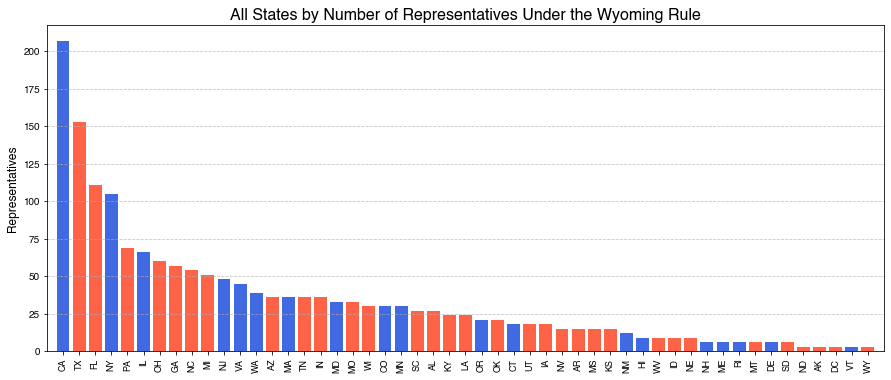
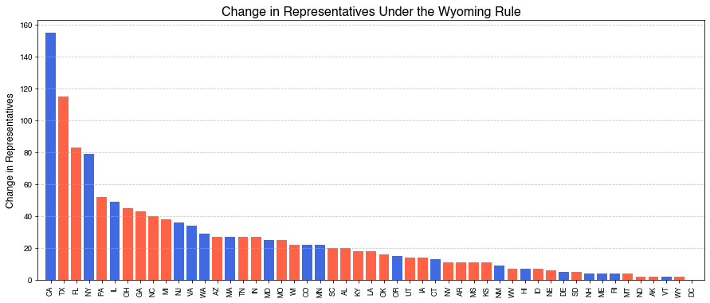
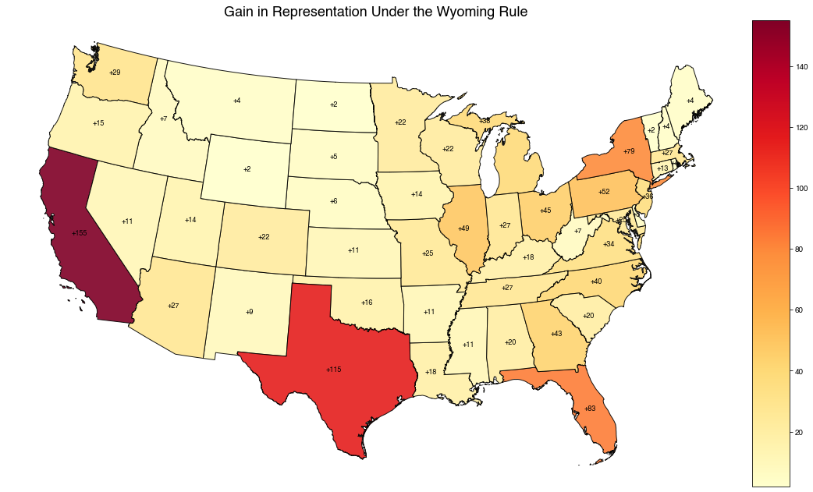

```python
import matplotlib.pyplot as plt
plt.rcParams.update({
    'figure.facecolor': 'none',
    'axes.facecolor': 'none',
    'savefig.facecolor': 'none',
})

```


```python
# import us state data
import pandas as pd

states = pd.read_csv("us_pop_by_state.csv")
```


```python
states.head()
```


<div>
<style scoped>
    .dataframe tbody tr th:only-of-type {
        vertical-align: middle;
    }

    .dataframe tbody tr th {
        vertical-align: top;
    }

    .dataframe thead th {
        text-align: right;
    }
</style>
<table border="1" class="dataframe">
  <thead>
    <tr style="text-align: right;">
      <th></th>
      <th>rank</th>
      <th>state</th>
      <th>state_code</th>
      <th>2020_census</th>
      <th>percent_of_total</th>
    </tr>
  </thead>
  <tbody>
    <tr>
      <th>0</th>
      <td>1.0</td>
      <td>California</td>
      <td>CA</td>
      <td>39538223</td>
      <td>0.1191</td>
    </tr>
    <tr>
      <th>1</th>
      <td>2.0</td>
      <td>Texas</td>
      <td>TX</td>
      <td>29145505</td>
      <td>0.0874</td>
    </tr>
    <tr>
      <th>2</th>
      <td>3.0</td>
      <td>Florida</td>
      <td>FL</td>
      <td>21538187</td>
      <td>0.0647</td>
    </tr>
    <tr>
      <th>3</th>
      <td>4.0</td>
      <td>New York</td>
      <td>NY</td>
      <td>20201249</td>
      <td>0.0586</td>
    </tr>
    <tr>
      <th>4</th>
      <td>5.0</td>
      <td>Pennsylvania</td>
      <td>PA</td>
      <td>13002700</td>
      <td>0.0386</td>
    </tr>
  </tbody>
</table>
</div>


```python
wyoming_pop = states.loc[states['state'] == 'Wyoming', '2020_census'].values[0]
states['wyomings'] = states['2020_census'] / wyoming_pop
```


```python
states['districts'] = round(states['wyomings'])
```


```python
states['reps'] = states['districts'] * 3
```


```python
states['pop_per_rep'] = states['2020_census'] / states['reps']
states['pop_per_district'] = states['2020_census'] / states['districts']
```


```python
states
```


<div>
<style scoped>
    .dataframe tbody tr th:only-of-type {
        vertical-align: middle;
    }

    .dataframe tbody tr th {
        vertical-align: top;
    }

    .dataframe thead th {
        text-align: right;
    }
</style>
<table border="1" class="dataframe">
  <thead>
    <tr style="text-align: right;">
      <th></th>
      <th>rank</th>
      <th>state</th>
      <th>state_code</th>
      <th>2020_census</th>
      <th>percent_of_total</th>
      <th>wyomings</th>
      <th>districts</th>
      <th>reps</th>
      <th>pop_per_rep</th>
      <th>pop_per_district</th>
    </tr>
  </thead>
  <tbody>
    <tr>
      <th>0</th>
      <td>1.0</td>
      <td>California</td>
      <td>CA</td>
      <td>39538223</td>
      <td>0.1191</td>
      <td>68.541483</td>
      <td>69.0</td>
      <td>207.0</td>
      <td>191005.908213</td>
      <td>573017.724638</td>
    </tr>
    <tr>
      <th>1</th>
      <td>2.0</td>
      <td>Texas</td>
      <td>TX</td>
      <td>29145505</td>
      <td>0.0874</td>
      <td>50.525188</td>
      <td>51.0</td>
      <td>153.0</td>
      <td>190493.496732</td>
      <td>571480.490196</td>
    </tr>
    <tr>
      <th>2</th>
      <td>3.0</td>
      <td>Florida</td>
      <td>FL</td>
      <td>21538187</td>
      <td>0.0647</td>
      <td>37.337522</td>
      <td>37.0</td>
      <td>111.0</td>
      <td>194037.720721</td>
      <td>582113.162162</td>
    </tr>
    <tr>
      <th>3</th>
      <td>4.0</td>
      <td>New York</td>
      <td>NY</td>
      <td>20201249</td>
      <td>0.0586</td>
      <td>35.019873</td>
      <td>35.0</td>
      <td>105.0</td>
      <td>192392.847619</td>
      <td>577178.542857</td>
    </tr>
    <tr>
      <th>4</th>
      <td>5.0</td>
      <td>Pennsylvania</td>
      <td>PA</td>
      <td>13002700</td>
      <td>0.0386</td>
      <td>22.540829</td>
      <td>23.0</td>
      <td>69.0</td>
      <td>188444.927536</td>
      <td>565334.782609</td>
    </tr>
    <tr>
      <th>5</th>
      <td>6.0</td>
      <td>Illinois</td>
      <td>IL</td>
      <td>12801989</td>
      <td>0.0382</td>
      <td>22.192887</td>
      <td>22.0</td>
      <td>66.0</td>
      <td>193969.530303</td>
      <td>581908.590909</td>
    </tr>
    <tr>
      <th>6</th>
      <td>7.0</td>
      <td>Ohio</td>
      <td>OH</td>
      <td>11799448</td>
      <td>0.0352</td>
      <td>20.454932</td>
      <td>20.0</td>
      <td>60.0</td>
      <td>196657.466667</td>
      <td>589972.400000</td>
    </tr>
    <tr>
      <th>7</th>
      <td>8.0</td>
      <td>Georgia</td>
      <td>GA</td>
      <td>10711908</td>
      <td>0.0320</td>
      <td>18.569627</td>
      <td>19.0</td>
      <td>57.0</td>
      <td>187928.210526</td>
      <td>563784.631579</td>
    </tr>
    <tr>
      <th>8</th>
      <td>9.0</td>
      <td>North Carolina</td>
      <td>NC</td>
      <td>10439388</td>
      <td>0.0316</td>
      <td>18.097200</td>
      <td>18.0</td>
      <td>54.0</td>
      <td>193322.000000</td>
      <td>579966.000000</td>
    </tr>
    <tr>
      <th>9</th>
      <td>10.0</td>
      <td>Michigan</td>
      <td>MI</td>
      <td>10077331</td>
      <td>0.0301</td>
      <td>17.469556</td>
      <td>17.0</td>
      <td>51.0</td>
      <td>197594.725490</td>
      <td>592784.176471</td>
    </tr>
    <tr>
      <th>10</th>
      <td>11.0</td>
      <td>New Jersey</td>
      <td>NJ</td>
      <td>9288994</td>
      <td>0.0268</td>
      <td>16.102935</td>
      <td>16.0</td>
      <td>48.0</td>
      <td>193520.708333</td>
      <td>580562.125000</td>
    </tr>
    <tr>
      <th>11</th>
      <td>12.0</td>
      <td>Virginia</td>
      <td>VA</td>
      <td>8631393</td>
      <td>0.0257</td>
      <td>14.962951</td>
      <td>15.0</td>
      <td>45.0</td>
      <td>191808.733333</td>
      <td>575426.200000</td>
    </tr>
    <tr>
      <th>12</th>
      <td>13.0</td>
      <td>Washington</td>
      <td>WA</td>
      <td>7705281</td>
      <td>0.0229</td>
      <td>13.357489</td>
      <td>13.0</td>
      <td>39.0</td>
      <td>197571.307692</td>
      <td>592713.923077</td>
    </tr>
    <tr>
      <th>13</th>
      <td>14.0</td>
      <td>Arizona</td>
      <td>AZ</td>
      <td>7151502</td>
      <td>0.0219</td>
      <td>12.397486</td>
      <td>12.0</td>
      <td>36.0</td>
      <td>198652.833333</td>
      <td>595958.500000</td>
    </tr>
    <tr>
      <th>14</th>
      <td>15.0</td>
      <td>Massachusetts</td>
      <td>MA</td>
      <td>7029917</td>
      <td>0.0209</td>
      <td>12.186712</td>
      <td>12.0</td>
      <td>36.0</td>
      <td>195275.472222</td>
      <td>585826.416667</td>
    </tr>
    <tr>
      <th>15</th>
      <td>16.0</td>
      <td>Tennessee</td>
      <td>TN</td>
      <td>6910840</td>
      <td>0.0206</td>
      <td>11.980286</td>
      <td>12.0</td>
      <td>36.0</td>
      <td>191967.777778</td>
      <td>575903.333333</td>
    </tr>
    <tr>
      <th>16</th>
      <td>17.0</td>
      <td>Indiana</td>
      <td>IN</td>
      <td>6785528</td>
      <td>0.0203</td>
      <td>11.763051</td>
      <td>12.0</td>
      <td>36.0</td>
      <td>188486.888889</td>
      <td>565460.666667</td>
    </tr>
    <tr>
      <th>17</th>
      <td>18.0</td>
      <td>Maryland</td>
      <td>MD</td>
      <td>6177224</td>
      <td>0.0185</td>
      <td>10.708526</td>
      <td>11.0</td>
      <td>33.0</td>
      <td>187188.606061</td>
      <td>561565.818182</td>
    </tr>
    <tr>
      <th>18</th>
      <td>19.0</td>
      <td>Missouri</td>
      <td>MO</td>
      <td>6154913</td>
      <td>0.0182</td>
      <td>10.669849</td>
      <td>11.0</td>
      <td>33.0</td>
      <td>186512.515152</td>
      <td>559537.545455</td>
    </tr>
    <tr>
      <th>19</th>
      <td>20.0</td>
      <td>Wisconsin</td>
      <td>WI</td>
      <td>5893718</td>
      <td>0.0175</td>
      <td>10.217054</td>
      <td>10.0</td>
      <td>30.0</td>
      <td>196457.266667</td>
      <td>589371.800000</td>
    </tr>
    <tr>
      <th>20</th>
      <td>21.0</td>
      <td>Colorado</td>
      <td>CO</td>
      <td>5773714</td>
      <td>0.0174</td>
      <td>10.009021</td>
      <td>10.0</td>
      <td>30.0</td>
      <td>192457.133333</td>
      <td>577371.400000</td>
    </tr>
    <tr>
      <th>21</th>
      <td>22.0</td>
      <td>Minnesota</td>
      <td>MN</td>
      <td>5706494</td>
      <td>0.0170</td>
      <td>9.892492</td>
      <td>10.0</td>
      <td>30.0</td>
      <td>190216.466667</td>
      <td>570649.400000</td>
    </tr>
    <tr>
      <th>22</th>
      <td>23.0</td>
      <td>South Carolina</td>
      <td>SC</td>
      <td>5118425</td>
      <td>0.0155</td>
      <td>8.873045</td>
      <td>9.0</td>
      <td>27.0</td>
      <td>189571.296296</td>
      <td>568713.888889</td>
    </tr>
    <tr>
      <th>23</th>
      <td>24.0</td>
      <td>Alabama</td>
      <td>AL</td>
      <td>5024279</td>
      <td>0.0148</td>
      <td>8.709838</td>
      <td>9.0</td>
      <td>27.0</td>
      <td>186084.407407</td>
      <td>558253.222222</td>
    </tr>
    <tr>
      <th>24</th>
      <td>25.0</td>
      <td>Louisiana</td>
      <td>LA</td>
      <td>4657757</td>
      <td>0.0140</td>
      <td>8.074454</td>
      <td>8.0</td>
      <td>24.0</td>
      <td>194073.208333</td>
      <td>582219.625000</td>
    </tr>
    <tr>
      <th>25</th>
      <td>26.0</td>
      <td>Kentucky</td>
      <td>KY</td>
      <td>4505836</td>
      <td>0.0135</td>
      <td>7.811092</td>
      <td>8.0</td>
      <td>24.0</td>
      <td>187743.166667</td>
      <td>563229.500000</td>
    </tr>
    <tr>
      <th>26</th>
      <td>27.0</td>
      <td>Oregon</td>
      <td>OR</td>
      <td>4237256</td>
      <td>0.0127</td>
      <td>7.345495</td>
      <td>7.0</td>
      <td>21.0</td>
      <td>201774.095238</td>
      <td>605322.285714</td>
    </tr>
    <tr>
      <th>27</th>
      <td>28.0</td>
      <td>Oklahoma</td>
      <td>OK</td>
      <td>3959353</td>
      <td>0.0119</td>
      <td>6.863736</td>
      <td>7.0</td>
      <td>21.0</td>
      <td>188540.619048</td>
      <td>565621.857143</td>
    </tr>
    <tr>
      <th>28</th>
      <td>29.0</td>
      <td>Connecticut</td>
      <td>CT</td>
      <td>3605944</td>
      <td>0.0107</td>
      <td>6.251084</td>
      <td>6.0</td>
      <td>18.0</td>
      <td>200330.222222</td>
      <td>600990.666667</td>
    </tr>
    <tr>
      <th>29</th>
      <td>30.0</td>
      <td>Utah</td>
      <td>UT</td>
      <td>3205958</td>
      <td>0.0097</td>
      <td>5.557688</td>
      <td>6.0</td>
      <td>18.0</td>
      <td>178108.777778</td>
      <td>534326.333333</td>
    </tr>
    <tr>
      <th>30</th>
      <td>31.0</td>
      <td>Iowa</td>
      <td>IA</td>
      <td>3271616</td>
      <td>0.0095</td>
      <td>5.671510</td>
      <td>6.0</td>
      <td>18.0</td>
      <td>181756.444444</td>
      <td>545269.333333</td>
    </tr>
    <tr>
      <th>31</th>
      <td>32.0</td>
      <td>Nevada</td>
      <td>NV</td>
      <td>3104614</td>
      <td>0.0093</td>
      <td>5.382003</td>
      <td>5.0</td>
      <td>15.0</td>
      <td>206974.266667</td>
      <td>620922.800000</td>
    </tr>
    <tr>
      <th>32</th>
      <td>33.0</td>
      <td>Arkansas</td>
      <td>AR</td>
      <td>3011524</td>
      <td>0.0091</td>
      <td>5.220627</td>
      <td>5.0</td>
      <td>15.0</td>
      <td>200768.266667</td>
      <td>602304.800000</td>
    </tr>
    <tr>
      <th>33</th>
      <td>34.0</td>
      <td>Mississippi</td>
      <td>MS</td>
      <td>2961279</td>
      <td>0.0090</td>
      <td>5.133525</td>
      <td>5.0</td>
      <td>15.0</td>
      <td>197418.600000</td>
      <td>592255.800000</td>
    </tr>
    <tr>
      <th>34</th>
      <td>35.0</td>
      <td>Kansas</td>
      <td>KS</td>
      <td>2937880</td>
      <td>0.0088</td>
      <td>5.092962</td>
      <td>5.0</td>
      <td>15.0</td>
      <td>195858.666667</td>
      <td>587576.000000</td>
    </tr>
    <tr>
      <th>35</th>
      <td>36.0</td>
      <td>New Mexico</td>
      <td>NM</td>
      <td>2117522</td>
      <td>0.0063</td>
      <td>3.670830</td>
      <td>4.0</td>
      <td>12.0</td>
      <td>176460.166667</td>
      <td>529380.500000</td>
    </tr>
    <tr>
      <th>36</th>
      <td>37.0</td>
      <td>Nebraska</td>
      <td>NE</td>
      <td>1961504</td>
      <td>0.0058</td>
      <td>3.400365</td>
      <td>3.0</td>
      <td>9.0</td>
      <td>217944.888889</td>
      <td>653834.666667</td>
    </tr>
    <tr>
      <th>37</th>
      <td>38.0</td>
      <td>Idaho</td>
      <td>ID</td>
      <td>1839106</td>
      <td>0.0054</td>
      <td>3.188182</td>
      <td>3.0</td>
      <td>9.0</td>
      <td>204345.111111</td>
      <td>613035.333333</td>
    </tr>
    <tr>
      <th>38</th>
      <td>39.0</td>
      <td>West Virginia</td>
      <td>WV</td>
      <td>1793716</td>
      <td>0.0054</td>
      <td>3.109496</td>
      <td>3.0</td>
      <td>9.0</td>
      <td>199301.777778</td>
      <td>597905.333333</td>
    </tr>
    <tr>
      <th>39</th>
      <td>40.0</td>
      <td>Hawaii</td>
      <td>HI</td>
      <td>1455271</td>
      <td>0.0043</td>
      <td>2.522785</td>
      <td>3.0</td>
      <td>9.0</td>
      <td>161696.777778</td>
      <td>485090.333333</td>
    </tr>
    <tr>
      <th>40</th>
      <td>41.0</td>
      <td>New Hampshire</td>
      <td>NH</td>
      <td>1377529</td>
      <td>0.0041</td>
      <td>2.388015</td>
      <td>2.0</td>
      <td>6.0</td>
      <td>229588.166667</td>
      <td>688764.500000</td>
    </tr>
    <tr>
      <th>41</th>
      <td>42.0</td>
      <td>Maine</td>
      <td>ME</td>
      <td>1362359</td>
      <td>0.0041</td>
      <td>2.361717</td>
      <td>2.0</td>
      <td>6.0</td>
      <td>227059.833333</td>
      <td>681179.500000</td>
    </tr>
    <tr>
      <th>42</th>
      <td>43.0</td>
      <td>Rhode Island</td>
      <td>RI</td>
      <td>1097379</td>
      <td>0.0032</td>
      <td>1.902361</td>
      <td>2.0</td>
      <td>6.0</td>
      <td>182896.500000</td>
      <td>548689.500000</td>
    </tr>
    <tr>
      <th>43</th>
      <td>44.0</td>
      <td>Montana</td>
      <td>MT</td>
      <td>1084225</td>
      <td>0.0032</td>
      <td>1.879558</td>
      <td>2.0</td>
      <td>6.0</td>
      <td>180704.166667</td>
      <td>542112.500000</td>
    </tr>
    <tr>
      <th>44</th>
      <td>45.0</td>
      <td>Delaware</td>
      <td>DE</td>
      <td>989948</td>
      <td>0.0029</td>
      <td>1.716124</td>
      <td>2.0</td>
      <td>6.0</td>
      <td>164991.333333</td>
      <td>494974.000000</td>
    </tr>
    <tr>
      <th>45</th>
      <td>46.0</td>
      <td>South Dakota</td>
      <td>SD</td>
      <td>886667</td>
      <td>0.0027</td>
      <td>1.537081</td>
      <td>2.0</td>
      <td>6.0</td>
      <td>147777.833333</td>
      <td>443333.500000</td>
    </tr>
    <tr>
      <th>46</th>
      <td>47.0</td>
      <td>North Dakota</td>
      <td>ND</td>
      <td>779094</td>
      <td>0.0023</td>
      <td>1.350598</td>
      <td>1.0</td>
      <td>3.0</td>
      <td>259698.000000</td>
      <td>779094.000000</td>
    </tr>
    <tr>
      <th>47</th>
      <td>48.0</td>
      <td>Alaska</td>
      <td>AK</td>
      <td>733391</td>
      <td>0.0022</td>
      <td>1.271370</td>
      <td>1.0</td>
      <td>3.0</td>
      <td>244463.666667</td>
      <td>733391.000000</td>
    </tr>
    <tr>
      <th>48</th>
      <td>49.0</td>
      <td>DC</td>
      <td>DC</td>
      <td>689545</td>
      <td>0.0021</td>
      <td>1.195361</td>
      <td>1.0</td>
      <td>3.0</td>
      <td>229848.333333</td>
      <td>689545.000000</td>
    </tr>
    <tr>
      <th>49</th>
      <td>50.0</td>
      <td>Vermont</td>
      <td>VT</td>
      <td>643077</td>
      <td>0.0019</td>
      <td>1.114806</td>
      <td>1.0</td>
      <td>3.0</td>
      <td>214359.000000</td>
      <td>643077.000000</td>
    </tr>
    <tr>
      <th>50</th>
      <td>51.0</td>
      <td>Wyoming</td>
      <td>WY</td>
      <td>576851</td>
      <td>0.0017</td>
      <td>1.000000</td>
      <td>1.0</td>
      <td>3.0</td>
      <td>192283.666667</td>
      <td>576851.000000</td>
    </tr>
    <tr>
      <th>51</th>
      <td>NaN</td>
      <td>Total U.S.</td>
      <td>Total</td>
      <td>331449281</td>
      <td>NaN</td>
      <td>574.583872</td>
      <td>575.0</td>
      <td>1725.0</td>
      <td>192144.510725</td>
      <td>576433.532174</td>
    </tr>
  </tbody>
</table>
</div>


```python
import matplotlib.pyplot as plt
import pandas as pd
import numpy as np

plt.rcParams['font.family'] = 'Helvetica'
# Load current representatives and votes
elections_df = pd.read_csv('../2025-08-09 Gerrymandering/2024_Elections.csv')
elections_df['D-Votes'] = pd.to_numeric(elections_df['D-Votes'].str.replace(',', ''))
elections_df['R-Votes'] = pd.to_numeric(elections_df['R-Votes'].str.replace(',', ''))
states = states.merge(elections_df[['State', 'Representatives', 'D-Votes', 'R-Votes']], left_on='state', right_on='State', how='left')
states['change'] = states['reps'] - states['Representatives']
states = states[states['state'] != 'Total U.S.']
states['color'] = np.where(states['D-Votes'] > states['R-Votes'], 'royalblue', 'tomato')

# Graph 1: All states in order of updated numbers
states_sorted_by_reps = states.sort_values('reps', ascending=False)
plt.figure(figsize=(15, 6))
plt.bar(states_sorted_by_reps['state_code'], states_sorted_by_reps['reps'], color=states_sorted_by_reps['color'])
plt.title('All States by Number of Representatives Under the Wyoming Rule', fontsize=16)
plt.ylabel('Representatives', fontsize=12)
plt.xticks(rotation=90, fontsize=9)
plt.grid(axis='y', linestyle='--', alpha=0.7)
plt.xlim(-1, len(states_sorted_by_reps))
plt.show()
```


    

    


```python
# Graph 2: All states in order of number change
states_sorted_by_change = states.sort_values('change', ascending=False)
plt.figure(figsize=(15, 6))
plt.bar(states_sorted_by_change['state_code'], states_sorted_by_change['change'], color=states_sorted_by_change['color'])
plt.title('Change in Representatives Under the Wyoming Rule', fontsize=16)
plt.ylabel('Change in Representatives', fontsize=12)
plt.xticks(rotation=90, fontsize=9)
plt.grid(axis='y', linestyle='--', alpha=0.7)
plt.xlim(-1, len(states_sorted_by_change))
plt.show()
```


    

    


```python
import geopandas as gpd
from mpl_toolkits.axes_grid1 import make_axes_locatable
import matplotlib.pyplot as plt

# Load state shapefiles
gdf = gpd.read_file('cb_2018_us_state_500k')
gdf = gdf[~gdf.STATEFP.isin(['72', '69', '60', '66', '78', '02', '15'])] # Exclude territories and AK/HI for cleaner map
gdf = gdf.to_crs('ESRI:102003') # Albers Equal Area

# Merge our states dataframe
gdf = gdf.merge(states, left_on='STUSPS', right_on='state_code', how='inner')
gdf['coords'] = gdf['geometry'].apply(lambda x: x.representative_point().coords[0])

fig, ax = plt.subplots(1, 1, figsize=(18, 12))
divider = make_axes_locatable(ax)
cax = divider.append_axes('right', size='5%', pad=0.1)

gdf.plot(column='change', ax=ax, legend=True, cax=cax, cmap='YlOrRd', edgecolor='black', alpha=0.9)

# Add text annotations
for idx, row in gdf.iterrows():
    if row['change'] > 0:
        ax.annotate(text=f"+{int(row['change'])}", xy=row['coords'], horizontalalignment='center', fontsize=9, color='black', weight='bold')
    elif row['change'] < 0:
        ax.annotate(text=f"{int(row['change'])}", xy=row['coords'], horizontalalignment='center', fontsize=9, color='black', weight='bold')
    else:
        ax.annotate(text="0", xy=row['coords'], horizontalalignment='center', fontsize=9, color='black', weight='bold')

ax.set_title('Gain in Representation Under the Wyoming Rule', fontsize=18)
ax.axis('off')
plt.show()
```


    

    

