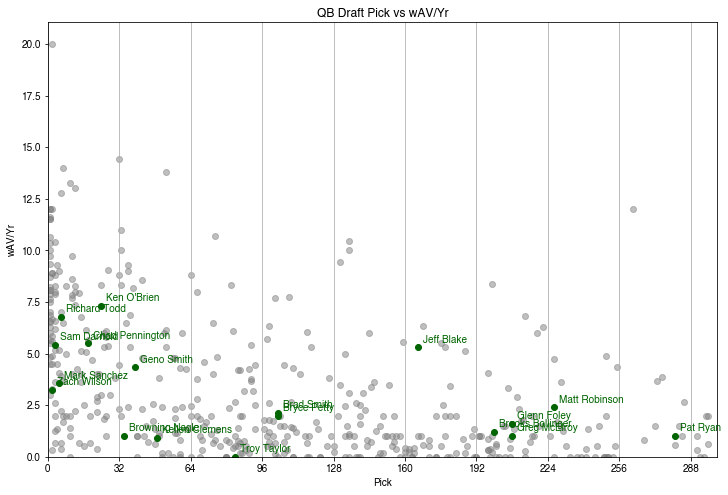
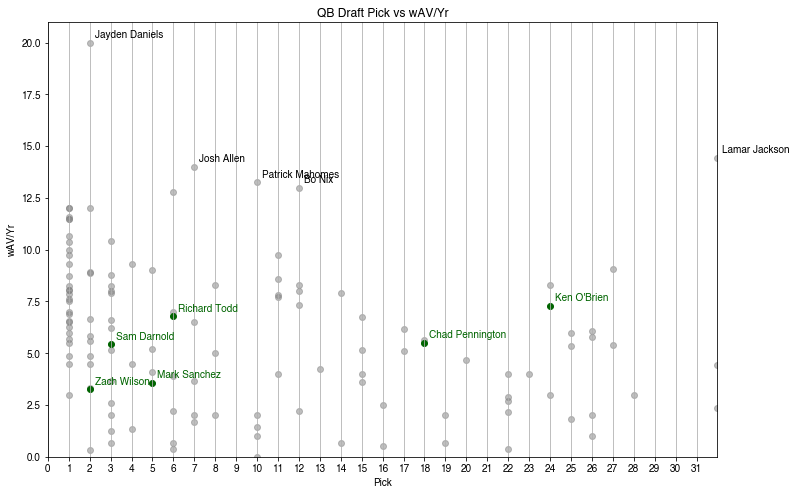

# Title: insert title here

#### **insert subheader**


```python
import pandas as pd
import time
import matplotlib.pyplot as plt
import numpy as np
```


```python
# Years to scrape
years = list(range(1970, 2024 + 1))

draft_rows = []

for year in years:
    url = f'https://www.pro-football-reference.com/years/{year}/draft.htm'
    time.sleep(10)
    
    try:
        df = pd.read_html(url)[0]
        df['Year'] = year
        draft_rows.append(df)
        print(f"Scraped year {year}: {len(df)} rows")
    except Exception as e:
        print(f"Error scraping year {year}: {e}")
        continue
  

# Combine all years
if draft_rows:
    draft_df = pd.concat(draft_rows, ignore_index=True)
    draft_df.head()
else:
    print("No data was scraped.")

```

    Scraped year 1970: 458 rows
    Scraped year 1971: 458 rows
    Scraped year 1972: 458 rows
    Scraped year 1973: 458 rows
    Scraped year 1974: 458 rows
    Scraped year 1975: 458 rows
    Scraped year 1976: 503 rows
    Scraped year 1977: 346 rows
    Scraped year 1978: 345 rows
    Scraped year 1979: 341 rows
    Scraped year 1980: 344 rows
    Scraped year 1981: 343 rows
    Scraped year 1982: 345 rows
    Scraped year 1983: 346 rows
    Scraped year 1984: 347 rows
    Scraped year 1985: 347 rows
    Scraped year 1986: 344 rows
    Scraped year 1987: 346 rows
    Scraped year 1988: 344 rows
    Scraped year 1989: 346 rows
    Scraped year 1990: 342 rows
    Scraped year 1991: 345 rows
    Scraped year 1992: 347 rows
    Scraped year 1993: 231 rows
    Scraped year 1994: 228 rows
    Scraped year 1995: 255 rows
    Scraped year 1996: 260 rows
    Scraped year 1997: 246 rows
    Scraped year 1998: 247 rows
    Scraped year 1999: 259 rows
    Scraped year 2000: 260 rows
    Scraped year 2001: 252 rows
    Scraped year 2002: 267 rows
    Scraped year 2003: 268 rows
    Scraped year 2004: 261 rows
    Scraped year 2005: 261 rows
    Scraped year 2006: 261 rows
    Scraped year 2007: 261 rows
    Scraped year 2008: 258 rows
    Scraped year 2009: 262 rows
    Scraped year 2010: 261 rows
    Scraped year 2011: 260 rows
    Scraped year 2012: 259 rows
    Scraped year 2013: 260 rows
    Scraped year 2014: 262 rows
    Scraped year 2015: 262 rows
    Scraped year 2016: 259 rows
    Scraped year 2017: 259 rows
    Scraped year 2018: 262 rows
    Scraped year 2019: 260 rows
    Scraped year 2020: 261 rows
    Scraped year 2021: 265 rows
    Scraped year 2022: 268 rows
    Scraped year 2023: 265 rows
    Scraped year 2024: 263 rows


```python
df.columns
```


    MultiIndex([( 'Unnamed: 0_level_0',                 'Rnd'),
                ( 'Unnamed: 1_level_0',                'Pick'),
                ( 'Unnamed: 2_level_0',                  'Tm'),
                ( 'Unnamed: 3_level_0',              'Player'),
                ( 'Unnamed: 4_level_0',                 'Pos'),
                ( 'Unnamed: 5_level_0',                 'Age'),
                ( 'Unnamed: 6_level_0',                  'To'),
                (               'Misc',                 'AP1'),
                (               'Misc',                  'PB'),
                ( 'Unnamed: 9_level_0',                  'St'),
                (         'Approx Val',                 'wAV'),
                (         'Approx Val',                'DrAV'),
                ('Unnamed: 12_level_0',                   'G'),
                (            'Passing',                 'Cmp'),
                (            'Passing',                 'Att'),
                (            'Passing',                 'Yds'),
                (            'Passing',                  'TD'),
                (            'Passing',                 'Int'),
                (            'Rushing',                 'Att'),
                (            'Rushing',                 'Yds'),
                (            'Rushing',                  'TD'),
                (          'Receiving',                 'Rec'),
                (          'Receiving',                 'Yds'),
                (          'Receiving',                  'TD'),
                ('Unnamed: 24_level_0',                'Solo'),
                ('Unnamed: 25_level_0',                 'Int'),
                ('Unnamed: 26_level_0',                  'Sk'),
                ('Unnamed: 27_level_0',        'College/Univ'),
                ('Unnamed: 28_level_0', 'Unnamed: 28_level_1'),
                (               'Year',                    '')],
               )


```python
qbs = draft_df[draft_df[('Unnamed: 4_level_0', 'Pos')] == 'QB']
qbs.head()
```


<div>
<style scoped>
    .dataframe tbody tr th:only-of-type {
        vertical-align: middle;
    }

    .dataframe tbody tr th {
        vertical-align: top;
    }

    .dataframe thead tr th {
        text-align: left;
    }
</style>
<table border="1" class="dataframe">
  <thead>
    <tr>
      <th></th>
      <th>Unnamed: 0_level_0</th>
      <th>Unnamed: 1_level_0</th>
      <th>Unnamed: 2_level_0</th>
      <th>Unnamed: 3_level_0</th>
      <th>Unnamed: 4_level_0</th>
      <th>Unnamed: 5_level_0</th>
      <th>Unnamed: 6_level_0</th>
      <th colspan="2" halign="left">Misc</th>
      <th>Unnamed: 9_level_0</th>
      <th>...</th>
      <th>Unnamed: 24_level_0</th>
      <th>Unnamed: 25_level_0</th>
      <th>Unnamed: 26_level_0</th>
      <th>Unnamed: 27_level_0</th>
      <th>Year</th>
      <th>Unnamed: 24_level_0</th>
      <th>Unnamed: 25_level_0</th>
      <th>Unnamed: 26_level_0</th>
      <th>Unnamed: 27_level_0</th>
      <th>Unnamed: 28_level_0</th>
    </tr>
    <tr>
      <th></th>
      <th>Rnd</th>
      <th>Pick</th>
      <th>Tm</th>
      <th>Player</th>
      <th>Pos</th>
      <th>Age</th>
      <th>To</th>
      <th>AP1</th>
      <th>PB</th>
      <th>St</th>
      <th>...</th>
      <th>Int</th>
      <th>Sk</th>
      <th>College/Univ</th>
      <th>Unnamed: 27_level_1</th>
      <th></th>
      <th>Solo</th>
      <th>Int</th>
      <th>Sk</th>
      <th>College/Univ</th>
      <th>Unnamed: 28_level_1</th>
    </tr>
  </thead>
  <tbody>
    <tr>
      <th>0</th>
      <td>1</td>
      <td>1</td>
      <td>PIT</td>
      <td>Terry Bradshaw HOF</td>
      <td>QB</td>
      <td>22</td>
      <td>1983</td>
      <td>1</td>
      <td>3</td>
      <td>13</td>
      <td>...</td>
      <td>NaN</td>
      <td>NaN</td>
      <td>Louisiana Tech</td>
      <td>NaN</td>
      <td>1970</td>
      <td>NaN</td>
      <td>NaN</td>
      <td>NaN</td>
      <td>NaN</td>
      <td>NaN</td>
    </tr>
    <tr>
      <th>2</th>
      <td>1</td>
      <td>3</td>
      <td>CLE</td>
      <td>Mike Phipps</td>
      <td>QB</td>
      <td>22</td>
      <td>1981</td>
      <td>0</td>
      <td>0</td>
      <td>5</td>
      <td>...</td>
      <td>NaN</td>
      <td>NaN</td>
      <td>Purdue</td>
      <td>College Stats</td>
      <td>1970</td>
      <td>NaN</td>
      <td>NaN</td>
      <td>NaN</td>
      <td>NaN</td>
      <td>NaN</td>
    </tr>
    <tr>
      <th>30</th>
      <td>2</td>
      <td>30</td>
      <td>BUF</td>
      <td>Dennis Shaw</td>
      <td>QB</td>
      <td>23</td>
      <td>1975</td>
      <td>0</td>
      <td>0</td>
      <td>3</td>
      <td>...</td>
      <td>NaN</td>
      <td>NaN</td>
      <td>San Diego St.</td>
      <td>College Stats</td>
      <td>1970</td>
      <td>NaN</td>
      <td>NaN</td>
      <td>NaN</td>
      <td>NaN</td>
      <td>NaN</td>
    </tr>
    <tr>
      <th>51</th>
      <td>2</td>
      <td>51</td>
      <td>MIN</td>
      <td>Bill Cappleman</td>
      <td>QB</td>
      <td>23</td>
      <td>1973</td>
      <td>0</td>
      <td>0</td>
      <td>0</td>
      <td>...</td>
      <td>NaN</td>
      <td>NaN</td>
      <td>Florida St.</td>
      <td>College Stats</td>
      <td>1970</td>
      <td>NaN</td>
      <td>NaN</td>
      <td>NaN</td>
      <td>NaN</td>
      <td>NaN</td>
    </tr>
    <tr>
      <th>129</th>
      <td>5</td>
      <td>126</td>
      <td>NOR</td>
      <td>Steve Ramsey</td>
      <td>QB</td>
      <td>22</td>
      <td>1976</td>
      <td>0</td>
      <td>0</td>
      <td>2</td>
      <td>...</td>
      <td>NaN</td>
      <td>NaN</td>
      <td>North Texas</td>
      <td>College Stats</td>
      <td>1970</td>
      <td>NaN</td>
      <td>NaN</td>
      <td>NaN</td>
      <td>NaN</td>
      <td>NaN</td>
    </tr>
  </tbody>
</table>
<p>5 rows × 34 columns</p>
</div>


```python
qbs = qbs[[('Year', ''), 
            ('Unnamed: 0_level_0', 'Rnd'), 
            ('Unnamed: 1_level_0', 'Pick'), 
            ('Unnamed: 2_level_0', 'Tm'), 
            ('Unnamed: 3_level_0', 'Player'), 
            ('Unnamed: 5_level_0', 'Age'), 
            ('Unnamed: 6_level_0', 'To'), 
            ('Misc', 'AP1'), 
            ('Misc', 'PB'), 
            ('Unnamed: 9_level_0', 'St'), 
            ('Approx Val', 'wAV'),
            ('Approx Val', 'DrAV'),
            ('Unnamed: 12_level_0', 'G'), 
            ('Passing', 'Cmp'), 
            ('Passing', 'Att'), 
            ('Passing', 'Yds'), 
            ('Passing', 'TD'), 
            ('Passing', 'Int')]]
```


```python
qbs.columns = ['Year', 'Round', 'Pick', 'Tm', 'Player', 'Age', 'To', 'AP1', 'PB', 'St', 'wAV', 'DrAV', 'G', 'Cmp', 'Att', 'Yds', 'TD', 'Int']
```


```python
qbs.head()
```


<div>
<style scoped>
    .dataframe tbody tr th:only-of-type {
        vertical-align: middle;
    }

    .dataframe tbody tr th {
        vertical-align: top;
    }

    .dataframe thead th {
        text-align: right;
    }
</style>
<table border="1" class="dataframe">
  <thead>
    <tr style="text-align: right;">
      <th></th>
      <th>Year</th>
      <th>Round</th>
      <th>Pick</th>
      <th>Tm</th>
      <th>Player</th>
      <th>Age</th>
      <th>To</th>
      <th>AP1</th>
      <th>PB</th>
      <th>St</th>
      <th>wAV</th>
      <th>DrAV</th>
      <th>G</th>
      <th>Cmp</th>
      <th>Att</th>
      <th>Yds</th>
      <th>TD</th>
      <th>Int</th>
    </tr>
  </thead>
  <tbody>
    <tr>
      <th>0</th>
      <td>1970</td>
      <td>1</td>
      <td>1</td>
      <td>PIT</td>
      <td>Terry Bradshaw HOF</td>
      <td>22</td>
      <td>1983</td>
      <td>1</td>
      <td>3</td>
      <td>13</td>
      <td>107</td>
      <td>107</td>
      <td>168</td>
      <td>2025</td>
      <td>3901</td>
      <td>27989</td>
      <td>212</td>
      <td>210</td>
    </tr>
    <tr>
      <th>2</th>
      <td>1970</td>
      <td>1</td>
      <td>3</td>
      <td>CLE</td>
      <td>Mike Phipps</td>
      <td>22</td>
      <td>1981</td>
      <td>0</td>
      <td>0</td>
      <td>5</td>
      <td>40</td>
      <td>32</td>
      <td>119</td>
      <td>886</td>
      <td>1799</td>
      <td>10506</td>
      <td>55</td>
      <td>108</td>
    </tr>
    <tr>
      <th>30</th>
      <td>1970</td>
      <td>2</td>
      <td>30</td>
      <td>BUF</td>
      <td>Dennis Shaw</td>
      <td>23</td>
      <td>1975</td>
      <td>0</td>
      <td>0</td>
      <td>3</td>
      <td>19</td>
      <td>19</td>
      <td>50</td>
      <td>489</td>
      <td>924</td>
      <td>6347</td>
      <td>35</td>
      <td>68</td>
    </tr>
    <tr>
      <th>51</th>
      <td>1970</td>
      <td>2</td>
      <td>51</td>
      <td>MIN</td>
      <td>Bill Cappleman</td>
      <td>23</td>
      <td>1973</td>
      <td>0</td>
      <td>0</td>
      <td>0</td>
      <td>0</td>
      <td>0</td>
      <td>8</td>
      <td>9</td>
      <td>18</td>
      <td>82</td>
      <td>0</td>
      <td>1</td>
    </tr>
    <tr>
      <th>129</th>
      <td>1970</td>
      <td>5</td>
      <td>126</td>
      <td>NOR</td>
      <td>Steve Ramsey</td>
      <td>22</td>
      <td>1976</td>
      <td>0</td>
      <td>0</td>
      <td>2</td>
      <td>23</td>
      <td>0</td>
      <td>54</td>
      <td>456</td>
      <td>921</td>
      <td>6437</td>
      <td>35</td>
      <td>58</td>
    </tr>
  </tbody>
</table>
</div>


```python
print(qbs.shape)
```

    (772, 18)


```python
# Convert 'Pick' column to numeric, coercing errors to NaN, and drop rows where 'Pick' is NaN
qbs['Pick'] = pd.to_numeric(qbs['Pick'], errors='coerce')
qbs = qbs.dropna(subset=['Pick'])
qbs['Pick'] = qbs['Pick'].astype(int)

qbs['wAV'] = pd.to_numeric(qbs['wAV'], errors='coerce')
qbs = qbs.dropna(subset=['wAV'])
qbs['wAV'] = qbs['wAV'].astype(float)

# Convert 'Round' column to numeric
qbs['Round'] = pd.to_numeric(qbs['Round'], errors='coerce')

# Convert 'Year' and 'To' columns to numeric
qbs['Year'] = pd.to_numeric(qbs['Year'], errors='coerce')
qbs['To'] = pd.to_numeric(qbs['To'], errors='coerce')
```


```python
qbs['wAV/Yr'] = qbs['wAV'] / (qbs['To'] - qbs['Year'])
```


```python
# Set font to Helvetica
plt.rcParams['font.family'] = 'Helvetica'

# Plot
plt.figure(figsize=(12, 8))

# Separate NYJ and other teams
nyj_mask = qbs['Tm'] == 'NYJ'
other_mask = qbs['Tm'] != 'NYJ'

# Plot other teams in gray
plt.scatter(qbs.loc[other_mask, 'Pick'], qbs.loc[other_mask, 'wAV/Yr'], 
            alpha=0.5, color='gray', label='Other Teams')

# Plot NYJ in green
plt.scatter(qbs.loc[nyj_mask, 'Pick'], qbs.loc[nyj_mask, 'wAV/Yr'], 
            alpha=1, color='darkgreen', label='NYJ')

# Label all NYJ points
nyj_qbs = qbs[nyj_mask]
for idx, row in nyj_qbs.iterrows():
    plt.annotate(row['Player'], 
                (row['Pick'], row['wAV/Yr']),
                xytext=(5, 5), textcoords='offset points',
                fontsize=10, alpha=1, fontfamily='Helvetica', color='darkgreen')

# Find and label the highest wAV/Yr points (top 10), excluding NYJ since they're already labeled
top_qbs = qbs[~nyj_mask].nlargest(10, 'wAV/Yr')
for idx, row in top_qbs.iterrows():
    plt.annotate(row['Player'], 
                (row['Pick'], row['wAV/Yr']),
                xytext=(5, 5), textcoords='offset points',
                fontsize=10, alpha=1, fontfamily='Helvetica')

# Add horizontal line at y=0
plt.axhline(y=0, color='black', linewidth=1)

plt.xlabel('Pick')
plt.ylabel('wAV/Yr')
plt.title('QB Draft Pick vs wAV/Yr')
plt.grid(True, which='both', axis='x')
plt.xticks(range(0, 301, 32))
plt.xlim(left=0, right=300)
plt.ylim(bottom=0)
plt.show()
```


    

    


```python
first_rounders = qbs[qbs['Round'] == 1]
```


```python
# Plot
plt.figure(figsize=(12, 8))

# Separate NYJ and other teams
nyj_mask_1 = first_rounders['Tm'] == 'NYJ'
other_mask_1 = first_rounders['Tm'] != 'NYJ'

# Plot other teams in gray
plt.scatter(first_rounders.loc[other_mask_1, 'Pick'], first_rounders.loc[other_mask_1, 'wAV/Yr'], 
            alpha=0.5, color='gray', label='Other Teams')

# Plot NYJ in green
plt.scatter(first_rounders.loc[nyj_mask_1, 'Pick'], first_rounders.loc[nyj_mask_1, 'wAV/Yr'], 
            alpha=1, color='darkgreen', label='NYJ')

# Label all NYJ points
nyj_firsts = first_rounders[nyj_mask_1]
for idx, row in nyj_firsts.iterrows():
    plt.annotate(row['Player'], 
                (row['Pick'], row['wAV/Yr']),
                xytext=(5, 5), textcoords='offset points',
                fontsize=10, alpha=1, fontfamily='Helvetica', color='darkgreen')

# Find and label the highest wAV/Yr points (top 10), excluding NYJ since they're already labeled
top_qbs_1 = first_rounders[~nyj_mask_1].nlargest(5, 'wAV/Yr')
for idx, row in top_qbs_1.iterrows():
    plt.annotate(row['Player'], 
                (row['Pick'], row['wAV/Yr']),
                xytext=(5, 5), textcoords='offset points',
                fontsize=10, alpha=1, fontfamily='Helvetica')

# Add horizontal line at y=0
plt.axhline(y=0, color='black', linewidth=1)

plt.xlabel('Pick')
plt.ylabel('wAV/Yr')
plt.title('QB Draft Pick vs wAV/Yr')
plt.grid(True, which='both', axis='x')
plt.xticks(range(0, 32, 1))
plt.xlim(left=0, right=32)
plt.ylim(bottom=0)
plt.show()
```


    

    

